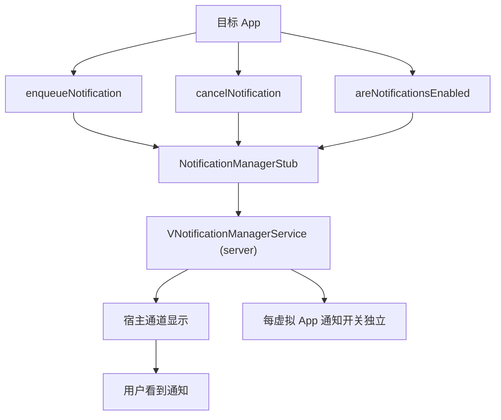

# notification · 通知代理

::: tip 源码路径
[src/main/java/com/lody/virtual/client/hook/proxies/notification/](https://github.com/android-security-engineer/VirtualXposed-skills/tree/vxp/VirtualApp/lib/src/main/java/com/lody/virtual/client/hook/proxies/notification/)（`NotificationManagerStub.java` + `MethodProxies.java`）
:::

拦截 `NotificationManager`（通知管理）。把目标 App 的通知注册到虚拟通知服务 `VNotificationManagerService`，共 16 个 MethodProxy。

## 拦截的服务

`"notification"`，继承 `BinderInvocationProxy`。

## 关键 MethodProxy

`MethodProxies.java` 定义通知的入队/取消/查询：

- **入队**：`EnqueueNotification` / `EnqueueNotificationWithTag` / `EnqueueNotificationWithTagPriority`
- **取消**：`CancelNotificationWithTag` / `CancelAllNotifications`
- **状态查询/设置**：`AreNotificationsEnabledForPackage` / `SetNotificationsEnabledForPackage`

## 与虚拟服务的关系

通知调用转发到 server 的 [`VNotificationManagerService`](../server/notification)，在虚拟环境内重实现通知管理——虚拟 App 的通知通过宿主通道显示，且每个虚拟 App 的通知开关独立。


## 拦截方法清单

从源码 `onBindMethods` / `@Inject` 内部类提取的 MethodProxy 拦截点：

```
- areNotificationsEnabled
- areNotificationsEnabledForPackage
- cancelAllNotifications
- cancelNotificationWithTag
- cancelToast
- createNotificationChannelGroups
- createNotificationChannels
- deleteNotificationChannel
- deleteNotificationChannelGroup
- enqueueNotification
- enqueueNotificationWithTag
- enqueueNotificationWithTagPriority
- enqueueToast
- getImportance
- getNotificationChannel
- getNotificationChannelGroups
- getNotificationChannels
- getNotificationPolicy
- isNotificationPolicyAccessGrantedForPackage
- removeAutomaticZenRules
- removeEdgeNotification
- setNotificationPolicy
- setNotificationsEnabledForPackage
```

## 拦截与转发流程



16 个 MethodProxy 把通知注册到 `VNotificationManagerService`，虚拟 App 通知经宿主通道显示，开关按虚拟 App 独立。
