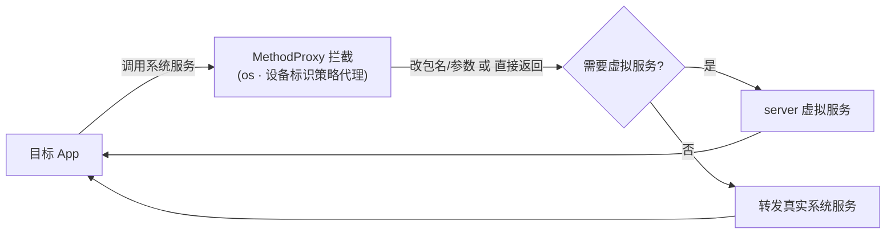

# os · 设备标识策略代理

::: tip 源码路径
[`src/main/java/com/lody/virtual/client/hook/proxies/os/DeviceIdentifiersPolicyServiceStub.java`](https://github.com/android-security-engineer/VirtualXposed-skills/blob/vxp/VirtualApp/lib/src/main/java/com/lody/virtual/client/hook/proxies/os/DeviceIdentifiersPolicyServiceStub.java)
:::

拦截 `IDeviceIdentifiersPolicyService`（设备标识访问策略，Android 10+ 限制 `Build.getSerial` 等）。替换 `ServiceManager.sCache["device_identifiers"]`，让目标 App 查询设备标识时返回伪造值。

## 拦截的服务

设备标识策略服务，继承 `BinderInvocationProxy`。

## 与设备信息伪造的关系

配合 [设备信息伪造](../../features/device-spoofing)：`Build.SERIAL` 在 `bindApplication` 时已被反射改写，这里再拦截系统层的设备标识策略查询，堵住通过系统服务获取真实序列号的路径。


## 拦截方法清单

从源码 `onBindMethods` / `@Inject` 内部类提取的 MethodProxy 拦截点：

```
- getSerialForPackage
```

## 拦截与转发流程


