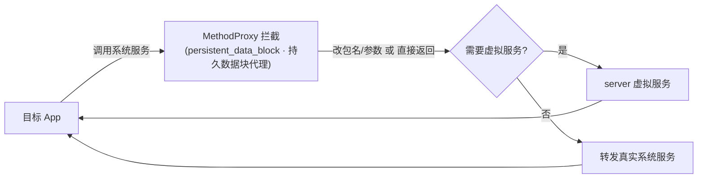

# persistent_data_block · 持久数据块代理

::: tip 源码路径
[`src/main/java/com/lody/virtual/client/hook/proxies/persistent_data_block/PersistentDataBlockServiceStub.java`](https://github.com/android-security-engineer/VirtualXposed-skills/blob/vxp/VirtualApp/lib/src/main/java/com/lody/virtual/client/hook/proxies/persistent_data_block/PersistentDataBlockServiceStub.java)
:::

拦截 `PersistentDataBlockService`（OEM 解锁状态/持久数据块）。替换 `ServiceManager.sCache["persistent_data_block"]`，短路目标 App 对该服务的写操作。

## 拦截的服务

`"persistent_data_block"`，继承 `BinderInvocationProxy`。

## 关键行为

以调用拦截/短路为主，避免虚拟 App 修改真实设备的持久数据块（如 OEM 解锁标志）。VirtualXposed 不重实现该服务。


## 拦截方法清单

从源码 `onBindMethods` / `@Inject` 内部类提取的 MethodProxy 拦截点：

```
- getDataBlockSize
- getMaximumDataBlockSize
- getOemUnlockEnabled
- read
- setOemUnlockEnabled
- wipe
- write
```

## 拦截与转发流程


