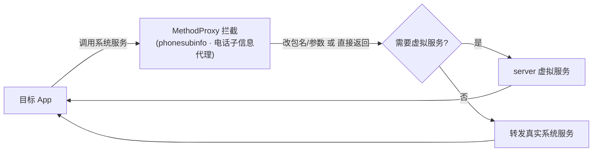

# phonesubinfo · 电话子信息代理

::: tip 源码路径
[src/main/java/com/lody/virtual/client/hook/proxies/phonesubinfo/](https://github.com/android-security-engineer/VirtualXposed-skills/tree/vxp/VirtualApp/lib/src/main/java/com/lody/virtual/client/hook/proxies/phonesubinfo/)（`PhoneSubInfoStub.java` + `MethodProxies.java`）
:::

拦截 `IPhoneSubInfo`（电话订阅信息：IMEI、ICCID 等）。这是 [设备信息伪造](../../features/device-spoofing) 的关键一环，共 18 个 MethodProxy。

## 拦截的服务

`"iphonesubinfo"`，继承 `BinderInvocationProxy`。

## 关键 MethodProxy

`MethodProxies.java` 定义设备标识查询的拦截：

- `GetDeviceId` — `getDeviceId`，返回伪造 IMEI
- `GetDeviceIdForSubscriber` — 按订阅 ID 查 IMEI，返回伪造值
- `GetIccSerialNumber` — `getIccSerialNumber`，返回伪造 ICCID
- `getIccSerialNumberForSubscriber` — 按订阅 ID 查 ICCID

（每个内部类含多版本重载，故 MethodProxy 总数达 18）

## 与虚拟服务的关系

返回值来自 `VDeviceInfo`（由 server 的 `VDeviceManagerService` 按 userId 持久化生成），见 [设备信息伪造](../../features/device-spoofing)。


## 拦截方法清单

从源码 `onBindMethods` / `@Inject` 内部类提取的 MethodProxy 拦截点：

```
- getDeviceId
- getDeviceIdForSubscriber
- getDeviceSvn
- getDeviceSvnUsingSubId
- getGroupIdLevel1
- getGroupIdLevel1ForSubscriber
- getIccSerialNumber
- getIccSerialNumberForSubscriber
- getImeiForSubscriber
- getLine1AlphaTag
- getLine1AlphaTagForSubscriber
- getLine1Number
- getLine1NumberForSubscriber
- getMsisdn
- getMsisdnForSubscriber
- getNaiForSubscriber
- getSubscriberId
- getSubscriberIdForSubscriber
- getVoiceMailAlphaTag
- getVoiceMailAlphaTagForSubscriber
- getVoiceMailNumber
- getVoiceMailNumberForSubscriber
```

## 拦截与转发流程


