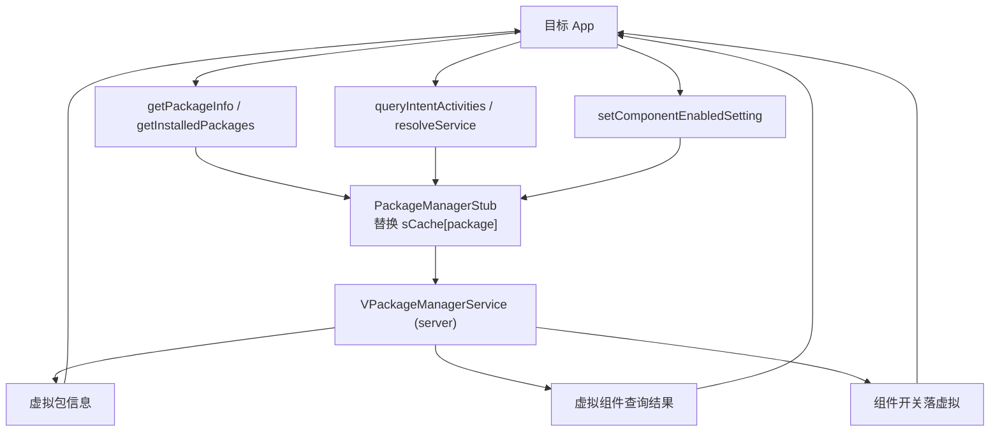

# pm · 包管理代理

::: tip 源码路径
[`src/main/java/com/lody/virtual/client/hook/proxies/pm/`](https://github.com/android-security-engineer/VirtualXposed-skills/tree/vxp/VirtualApp/lib/src/main/java/com/lody/virtual/client/hook/proxies/pm)（3 个文件）
:::

拦截 `PackageManager`（包管理）——核心代理之一，共 28 个 MethodProxy。让目标 App 的包查询/组件开关都走虚拟 PMS。

## 文件组成

| 文件 | 职责 |
| --- | --- |
| `PackageManagerStub.java` | 主代理，替换 `ServiceManager.sCache["package"]` |
| `LauncherAppsStub.java` | `LauncherApps`（桌面图标/快捷方式）服务代理，`LAUNCHER_APPS_SERVICE` |
| `MethodProxies.java` | 28 个 MethodProxy 集合 |

## 关键 MethodProxy（节选）

`MethodProxies.java` 覆盖 PMS 查询全集：

- **包/应用信息**：`GetApplicationInfo` / `GetPackageUid` / `GetPackageUidEtc` / `GetPackageGids` / `GetPackageGidsEtc` / `GetPackagesForUid` / `getNameForUid` / `IsPackageAvailable` / `IsPackageForzen`
- **组件信息**：`GetActivityInfo` / `GetServiceInfo` / `GetReceiverInfo` / `GetProviderInfo` / `GetPermissionGroupInfo` / `GetPermissions` / `GetPermissionFlags`
- **Intent 查询**：`QueryIntentActivities` / `QueryIntentServices` / `QueryIntentReceivers` / `QueryIntentContentProviders` / `ResolveIntent` / `ResolveService` / `ActivitySupportsIntent` / `ResolveContentProvider` / `QueryContentProviders`
- **已装列表**：`GetInstalledApplications` / `GetInstalledPackages`
- **组件开关**：`SetComponentEnabledSetting` / `GetComponentEnabledSetting` / `SetApplicationEnabledSetting` / `GetApplicationEnabledSetting` / `SetApplicationBlockedSettingAsUser` / `GetApplicationBlockedSettingAsUser` / `SetPackageStoppedState`
- **偏好 Activity**：`AddPackageToPreferred` / `RemovePackageFromPreferred` / `GetPreferredActivities` / `ClearPackagePreferredActivities` / `ClearPackagePersistentPreferredActivities`
- **权限/签名**：`CheckPermission` / `CheckSignatures` / `checkUidSignatures` / `RevokeRuntimePermission`
- **其他**：`GetInstallerPackageName` / `GetPackageInstaller` / `DeletePackage` / `DeleteApplicationCacheFiles` / `FreeStorageAndNotify`

## 与虚拟服务的关系

所有查询转发到 server 的 [`VPackageManagerService`](../server/pm)，返回虚拟环境内的包信息——目标 App 看不到真实系统装的 App，只看到虚拟环境里的。


## 拦截方法清单

从源码 `onBindMethods` / `@Inject` 内部类提取的 MethodProxy 拦截点：

```
- activitySupportsIntent
- addOnAppsChangedListener
- addOnPermissionsChangeListener
- addPackageToPreferred
- addPermission
- addPermissionAsync
- checkPackageStartable
- checkPermission
- checkSignatures
- checkUidSignatures
- clearPackagePersistentPreferredActivities
- clearPackagePreferredActivities
- deleteApplicationCacheFiles
- deletePackage
- freeStorageAndNotify
- getActivityInfo
- getApplicationBlockedSettingAsUser
- getApplicationEnabledSetting
- getApplicationInfo
- getComponentEnabledSetting
- getInstalledApplications
- getInstalledPackages
- getInstallerPackageName
- getLauncherActivities
- getNameForUid
- getPackageGids
- getPackageInfo
- getPackageInstaller
- getPackageUid
- getPackagesForUid
- getPermissionFlags
- getPermissionGroupInfo
- getPermissions
- getPreferredActivities
- getProviderInfo
- getReceiverInfo
- getServiceInfo
- getShortcutConfigActivities
- getShortcutConfigActivityIntent
- getShortcutIconFd
- getShortcutIconResId
- getShortcuts
- hasShortcutHostPermission
- isActivityEnabled
- isInstantApp
- isPackageAvailable
- isPackageEnabled
- isPackageForzen
- notifyDexLoad
- notifyPackageUse
- performDexOpt
- performDexOptIfNeeded
- performDexOptSecondary
- pinShortcuts
- queryContentProviders
- queryIntentActivities
- queryIntentContentProviders
- queryIntentReceivers
- queryIntentServices
- removeOnPermissionsChangeListener
- removePackageFromPreferred
- resolveActivity
- resolveContentProvider
- resolveIntent
- resolveService
- revokeRuntimePermission
- setApplicationBlockedSettingAsUser
- setApplicationEnabledSetting
- setComponentEnabledSetting
- setInstantAppCookie
- setPackageStoppedState
- showAppDetailsAsUser
- startActivityAsUser
- startShortcut
```

## 拦截与转发流程



28 个 MethodProxy 全部转发到 `VPackageManagerService`，目标 App 看不到真实系统 App，只看到虚拟环境内的。
