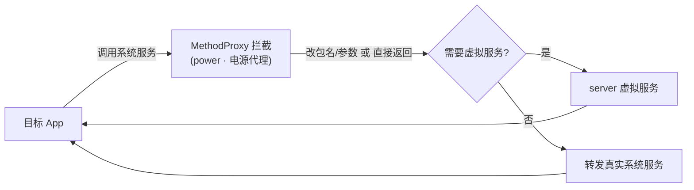

# power · 电源代理

::: tip 源码路径
[`src/main/java/com/lody/virtual/client/hook/proxies/power/PowerManagerStub.java`](https://github.com/android-security-engineer/VirtualXposed-skills/blob/vxp/VirtualApp/lib/src/main/java/com/lody/virtual/client/hook/proxies/power/PowerManagerStub.java)
:::

拦截 `PowerManager`（电源/屏幕唤醒）。替换 `ServiceManager.sCache["power"]`，改写唤醒锁（wake lock）请求的 callingUid/包名/tag。

## 拦截的服务

`Context.POWER_SERVICE`，继承 `BinderInvocationProxy`。

## 关键行为

UID/包名/tag 参数改写为主，让唤醒锁归属虚拟包，卸载虚拟 App 时其持有的唤醒锁可被识别清理。VirtualXposed 不重实现电源服务。


## 拦截方法清单

从源码 `onBindMethods` / `@Inject` 内部类提取的 MethodProxy 拦截点：

```
- acquireWakeLock
- acquireWakeLockWithUid
- updateWakeLockWorkSource
```

## 拦截与转发流程


