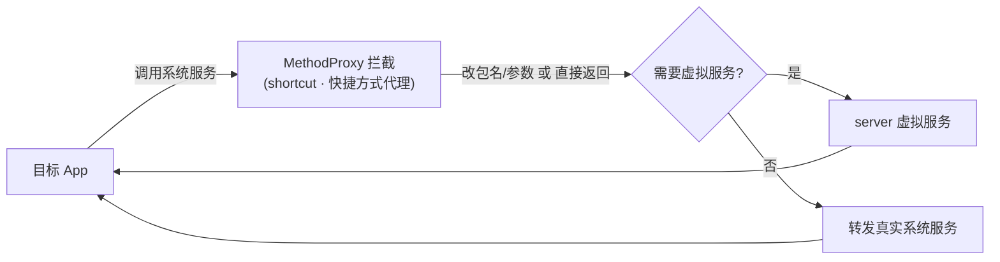

# shortcut · 快捷方式代理

::: tip 源码路径
[`src/main/java/com/lody/virtual/client/hook/proxies/shortcut/ShortcutServiceStub.java`](https://github.com/android-security-engineer/VirtualXposed-skills/blob/vxp/VirtualApp/lib/src/main/java/com/lody/virtual/client/hook/proxies/shortcut/ShortcutServiceStub.java)
:::

拦截 `ShortcutService`（桌面快捷方式）。替换 `ServiceManager.sCache["shortcut"]`，改写快捷方式创建/查询的 callingUid/包名。

## 拦截的服务

`"shortcut"`，继承 `BinderInvocationProxy`。

## 关键行为

UID/包名参数改写为主，让虚拟 App 创建的快捷方式归属虚拟身份。VirtualXposed 不重实现快捷方式服务。


## 拦截方法清单

从源码 `onBindMethods` / `@Inject` 内部类提取的 MethodProxy 拦截点：

```
- addDynamicShortcuts
- createShortcutResultIntent
- disableShortcuts
- enableShortcuts
- getDynamicShortcuts
- getIconMaxDimensions
- getManifestShortcuts
- getMaxShortcutCountPerActivity
- getPinnedShortcuts
- getRateLimitResetTime
- getRemainingCallCount
- onApplicationActive
- removeAllDynamicShortcuts
- reportShortcutUsed
- requestPinShortcut
- setDynamicShortcuts
```

## 拦截与转发流程


