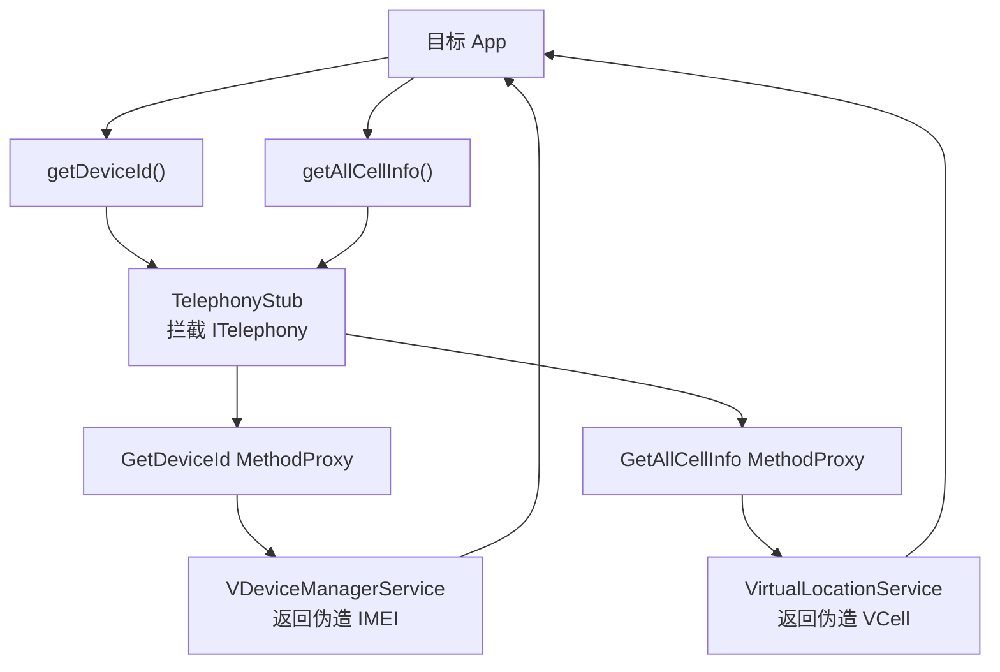

# telephony · 电话代理

::: tip 源码路径
[`src/main/java/com/lody/virtual/client/hook/proxies/telephony/`](https://github.com/android-security-engineer/VirtualXposed-skills/tree/vxp/VirtualApp/lib/src/main/java/com/lody/virtual/client/hook/proxies/telephony)（3 个文件）
:::

拦截电话相关服务——核心代理之一，共 33 个 MethodProxy，是 [设备信息伪造](../../features/device-spoofing) 和 [虚拟定位](../../features/virtual-location) 的重要落点。

## 文件组成

| 文件 | 职责 |
| --- | --- |
| `TelephonyStub.java` | 主代理，拦截 `phone`（ITelephony）服务，返回伪造 IMEI/基站 |
| `TelephonyRegistryStub.java` | 拦截 `telephony.registry`，改写电话状态监听回调 |
| `MethodProxies.java` | MethodProxy 集合 |

## 关键 MethodProxy

`MethodProxies.java` 定义设备/基站信息查询：

- **设备**：`GetDeviceId` — 返回伪造 IMEI
- **基站**：`GetCellLocation` / `GetAllCellInfo` / `GetNeighboringCellInfo` / `getAllCellInfoUsingSubId` — 返回伪造 `VCell`

（每个含多订阅 ID 重载，故总数达 33）

## 与虚拟服务的关系

返回值来自 server 的 `VirtualLocationService`（基站）和 `VDeviceManagerService`（IMEI），见 [虚拟定位](../../features/virtual-location) 与 [设备信息伪造](../../features/device-spoofing)。


## 拦截方法清单

从源码 `onBindMethods` / `@Inject` 内部类提取的 MethodProxy 拦截点：

```
- call
- getAllCellInfo
- getAllCellInfoUsingSubId
- getCalculatedPreferredNetworkType
- getCdmaEriIconIndex
- getCdmaEriIconIndexForSubscriber
- getCdmaEriIconMode
- getCdmaEriIconModeForSubscriber
- getCdmaEriText
- getCdmaEriTextForSubscriber
- getCellLocation
- getDataNetworkType
- getDataNetworkTypeForSubscriber
- getDeviceId
- getDeviceIdWithFeature
- getLine1AlphaTagForDisplay
- getLine1NumberForDisplay
- getLteOnCdmaMode
- getLteOnCdmaModeForSubscriber
- getMergedSubscriberIds
- getNeighboringCellInfo
- getNetworkTypeForSubscriber
- getPcscfAddress
- getRadioAccessFamily
- getVoiceNetworkTypeForSubscriber
- isIdle
- isIdleForSubscriber
- isOffhook
- isOffhookForSubscriber
- isRadioOn
- isRadioOnForSubscriber
- isRinging
- isRingingForSubscriber
- isSimPinEnabled
- isVideoCallingEnabled
- listen
- listenForSubscriber
- listenWithEventList
```

## 拦截与转发流程



设备与基站两类查询分别落到 `VDeviceManagerService` 与 `VirtualLocationService`，目标 App 拿到的全是伪造值。
