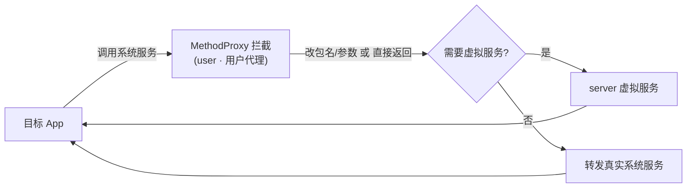

# user · 用户代理

::: tip 源码路径
[`src/main/java/com/lody/virtual/client/hook/proxies/user/UserManagerStub.java`](https://github.com/android-security-engineer/VirtualXposed-skills/blob/vxp/VirtualApp/lib/src/main/java/com/lody/virtual/client/hook/proxies/user/UserManagerStub.java)
:::

拦截 `UserManager`（多用户管理）。把目标 App 的用户查询/创建调用转发到虚拟用户服务 `VUserManagerService`，让虚拟环境内有多用户概念。

## 拦截的服务

`Context.USER_SERVICE`，继承 `BinderInvocationProxy`。

## 与虚拟服务的关系

转发到 server 的 `VUserManagerService`，返回虚拟用户列表、用户信息——这是 VirtualXposed 多用户（模拟"多台设备"）能力的客户端入口，见 [进程模型](../../architecture/process-model)。


## 拦截方法清单

从源码 `onBindMethods` / `@Inject` 内部类提取的 MethodProxy 拦截点：

```
- createProfileForUser
- createUser
- getApplicationRestrictions
- getApplicationRestrictionsForUser
- getDefaultGuestRestrictions
- getProfileParent
- getProfiles
- getUserIcon
- getUserInfo
- getUsers
- removeRestrictions
- setApplicationRestrictions
- setDefaultGuestRestrictions
```

## 拦截与转发流程


