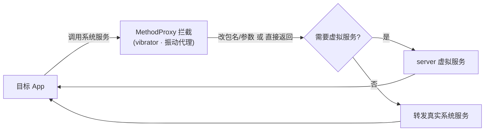

# vibrator · 振动代理

::: tip 源码路径
[`src/main/java/com/lody/virtual/client/hook/proxies/vibrator/VibratorStub.java`](https://github.com/android-security-engineer/VirtualXposed-skills/blob/vxp/VirtualApp/lib/src/main/java/com/lody/virtual/client/hook/proxies/vibrator/VibratorStub.java)
:::

拦截 `IVibratorService`（振动）。替换 `ServiceManager.sCache["vibrator"]`，把振动请求的 callingUid 改写为虚拟 UID。

## 拦截的服务

`Context.VIBRATOR_SERVICE`，继承 `BinderInvocationProxy`。

## 关键 MethodProxy

用 `VibrateMethodProxy`（继承 `ReplaceCallingPkgMethodProxy`）拦截 `vibrate` / `vibratePattern`，以及三星特有的 `vibrateMagnitude` / `vibratePatternMagnitude`。`beforeCall` 里把 `args[0]`（Integer 类型的 UID）替换为 `getRealUid()`。

## 关键行为

让振动归属虚拟身份。VirtualXposed 不重实现振动服务，沿用真实系统硬件。


## 拦截方法清单

从源码 `onBindMethods` / `@Inject` 内部类提取的 MethodProxy 拦截点：

```
- vibrate
- vibrateMagnitude
- vibratePattern
- vibratePatternMagnitude
```

## 拦截与转发流程


