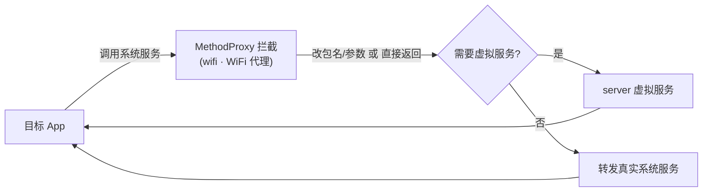

# wifi · WiFi 代理

::: tip 源码路径
[`src/main/java/com/lody/virtual/client/hook/proxies/wifi/WifiManagerStub.java`](https://github.com/android-security-engineer/VirtualXposed-skills/blob/vxp/VirtualApp/lib/src/main/java/com/lody/virtual/client/hook/proxies/wifi/WifiManagerStub.java)
:::

拦截 `WifiManager`（WiFi 管理）。替换 `ServiceManager.sCache["wifi"]`，改写 WiFi 查询/连接调用的 callingUid/包名，并配合 MAC 伪造。

## 拦截的服务

`Context.WIFI_SERVICE`，继承 `BinderInvocationProxy`。

## 与设备信息伪造的关系

`getConnectionInfo().getMacAddress()` 返回的 MAC 由 native IO 重定向伪造（见 [设备信息伪造](../../features/device-spoofing)），这里再拦截 Java 侧调用，双重保障。


## 拦截方法清单

从源码 `onBindMethods` / `@Inject` 内部类提取的 MethodProxy 拦截点：

```
- acquireWifiLock
- createDhcpInfo
- getBatchedScanResults
- getConnectionInfo
- getScanResults
- getWifiEnabledState
- isWifiEnabled
- requestBatchedScan
- startLocationRestrictedScan
- startScan
- updateWifiLockWorkSource
```

## 拦截与转发流程


