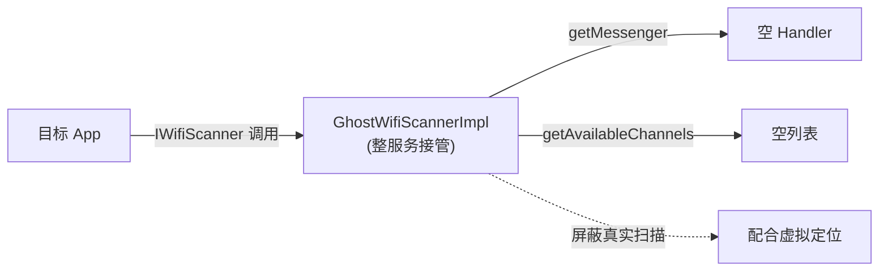

# wifi_scanner · WiFi 扫描代理

::: tip 源码路径
[`src/main/java/com/lody/virtual/client/hook/proxies/wifi_scanner/`](https://github.com/android-security-engineer/VirtualXposed-skills/tree/vxp/VirtualApp/lib/src/main/java/com/lody/virtual/client/hook/proxies/wifi_scanner)（2 个文件）
:::

拦截 `WifiScanner`（WiFi 扫描服务，用于定位）。共 2 个文件。

## 文件组成

| 文件 | 职责 |
| --- | --- |
| `WifiScannerStub.java` | 主代理，用 `GhostWifiScannerImpl` 直接替换 `sCache["wifiscanner"]`——**整服务被接管**而非方法拦截 |
| `GhostWifiScannerImpl.java` | "幽灵" `IWifiScanner.Stub` 实现，提供空的扫描结果源 |

## 接管机制

不同于普通代理（拦方法、改参数后放行），`WifiScannerStub` 把整个 `IWifiScanner` 替换为 `GhostWifiScannerImpl`。`getMessenger` 返回一个空 `Handler` 的 Messenger，`getAvailableChannels` 返回空列表——App 拿不到真实扫描结果，使基于 WiFi 扫描的定位失效或落到伪造坐标。

## 与虚拟定位的关系

WiFi 扫描结果常被用于基于 AP MAC 的定位反查。`GhostWifiScannerImpl` 配合 [虚拟定位](../../features/virtual-location) 返回伪造的扫描结果，使基于 WiFi 的定位也落在伪造坐标。

## 拦截与转发流程

