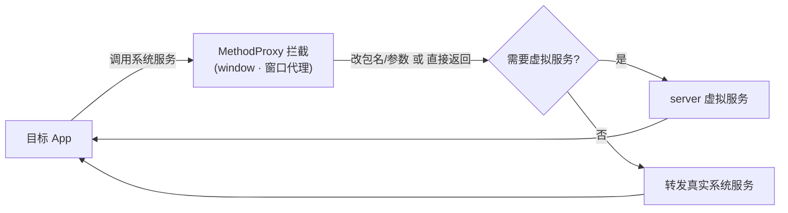

# window · 窗口代理

::: tip 源码路径
[src/main/java/com/lody/virtual/client/hook/proxies/window/](https://github.com/android-security-engineer/VirtualXposed-skills/tree/vxp/VirtualApp/lib/src/main/java/com/lody/virtual/client/hook/proxies/window/)（`WindowManagerStub.java` + `MethodProxies.java` + `session/` 子目录）
:::

拦截 `WindowManager`（窗口管理）——`WindowManagerStub` 替换 `ServiceManager.sCache["window"]`，`session/` 处理 `IWindowSession`（每个窗口的会话）。

## 拦截的服务

`Context.WINDOW_SERVICE`，继承 `BinderInvocationProxy`。

## 关键 MethodProxy

`MethodProxies.java` 定义：

- `OpenSession` — 创建窗口会话，改写 callingUid
- `OverridePendingAppTransition` / `OverridePendingAppTransitionInPlace` — 覆盖转场动画，配合 Stub Activity 的启动过渡
- `SetAppStartingWindow` — 设置启动窗口（splash），改写包名
- `BasePatchSession` — `IWindowSession` 的补丁基类（在 `session/` 子目录）

## 与 Stub Activity 的配合

窗口转场和启动窗口的包名改写，确保 Stub Activity 占位期间的目标 App 启动动画看起来自然，不泄露真实身份，见 [Stub Activity 机制](../../features/stub-activity)。


## 拦截方法清单

从源码 `onBindMethods` / `@Inject` 内部类提取的 MethodProxy 拦截点：

```
- addAppToken
- openSession
- overridePendingAppTransition
- overridePendingAppTransitionInPlace
- setAppStartingWindow
- setScreenCaptureDisabled
```

## 拦截与转发流程


