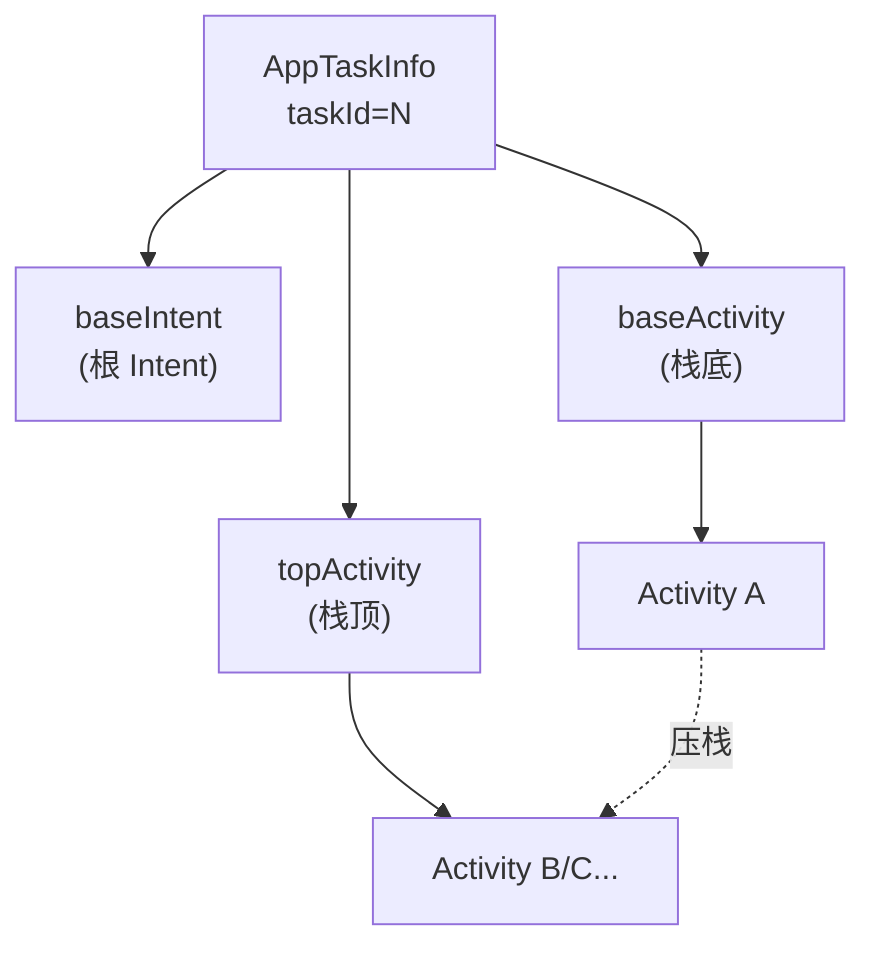

# AppTaskInfo · 任务信息

::: tip 源码路径
[`src/main/java/com/lody/virtual/remote/AppTaskInfo.java`](https://github.com/android-security-engineer/VirtualXposed-skills/blob/vxp/VirtualApp/lib/src/main/java/com/lody/virtual/remote/AppTaskInfo.java)
:::

`AppTaskInfo` 是任务（Task）信息载体，实现 `Parcelable`。它记录一个虚拟任务的 id、基础 Intent、基础 Activity 与栈顶 Activity，跨进程传递任务状态。

## 字段

| 字段 | 类型 | 含义 |
| --- | --- | --- |
| `taskId` | `int` | 任务 id |
| `baseIntent` | `Intent` | 任务的根 Intent |
| `baseActivity` | `ComponentName` | 任务栈底 Activity |
| `topActivity` | `ComponentName` | 任务栈顶 Activity |

## Parcel 实现

- `writeToParcel` 依次写出三个 `Parcelable`（Intent / 两个 ComponentName）。
- `CREATOR` 从 Parcel 读回重建对象。

## 用途

`VActivityManagerService` 的任务管理（`getTasks` / `moveTaskToFront` 等）跨进程返回任务列表时，用 `AppTaskInfo` 作为元素。client 端 [am 代理](../proxies/am) 把它转成 `ActivityManager.AppTask` 暴露给虚拟 App。

`VActivityManagerService` 的任务管理（`getTasks` / `moveTaskToFront` 等）跨进程返回任务列表时，用 `AppTaskInfo` 作为元素。client 端 [am 代理](../proxies/am) 把它转成 `ActivityManager.AppTask` 暴露给虚拟 App。

## 任务栈结构

`baseActivity` 是任务回退栈最底层的 Activity，`topActivity` 是当前栈顶——虚拟 App 调 `ActivityManager.getRunningTasks()` 拿到的就是这组信息。

## 关联

- [活动管理](/features/activity-manager)。
- [`VActivityManagerService`](../server/am)。
- [am 代理](../proxies/am)。
