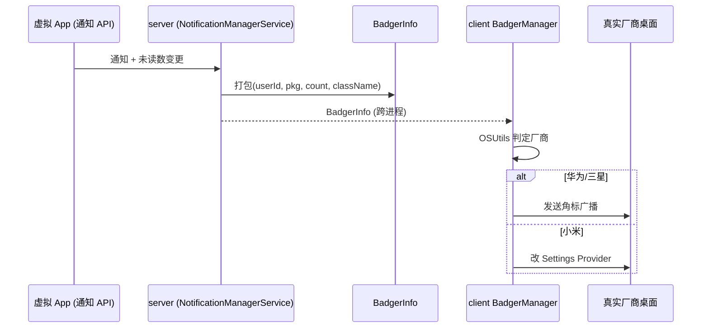

# BadgerInfo · 角标信息

::: tip 源码路径
[`src/main/java/com/lody/virtual/remote/BadgerInfo.java`](https://github.com/android-security-engineer/VirtualXposed-skills/blob/vxp/VirtualApp/lib/src/main/java/com/lody/virtual/remote/BadgerInfo.java)
:::

`BadgerInfo` 是桌面角标信息载体，实现 `Parcelable`。跨进程传递虚拟 App 的未读角标数量，供 [client/badger](../client/badger) 转发到真实厂商桌面。

## 字段

| 字段 | 类型 | 含义 |
| --- | --- | --- |
| `userId` | `int` | 虚拟用户 id |
| `packageName` | `String` | 虚拟 App 包名 |
| `badgerCount` | `int` | 角标数量 |
| `className` | `String` | 触发角标的组件类名 |

## Parcel 实现

标准四字段读写 + `CREATOR`。

## 用途

虚拟 App 调用通知 API 产生未读数时，server 把更新打包成 `BadgerInfo` 跨进程传给 client 的 `BadgerManager`，后者按 [`OSUtils`](../helper/utils/os-utils) 判定的厂商走对应角标协议（华为广播、小米 Provider 等）转发到真实桌面。

## 角标传递流

## 关联

- [client/badger](../client/badger)：`BadgerManager` 消费方。
- [`OSUtils`](../helper/utils/os-utils)：厂商判定。
