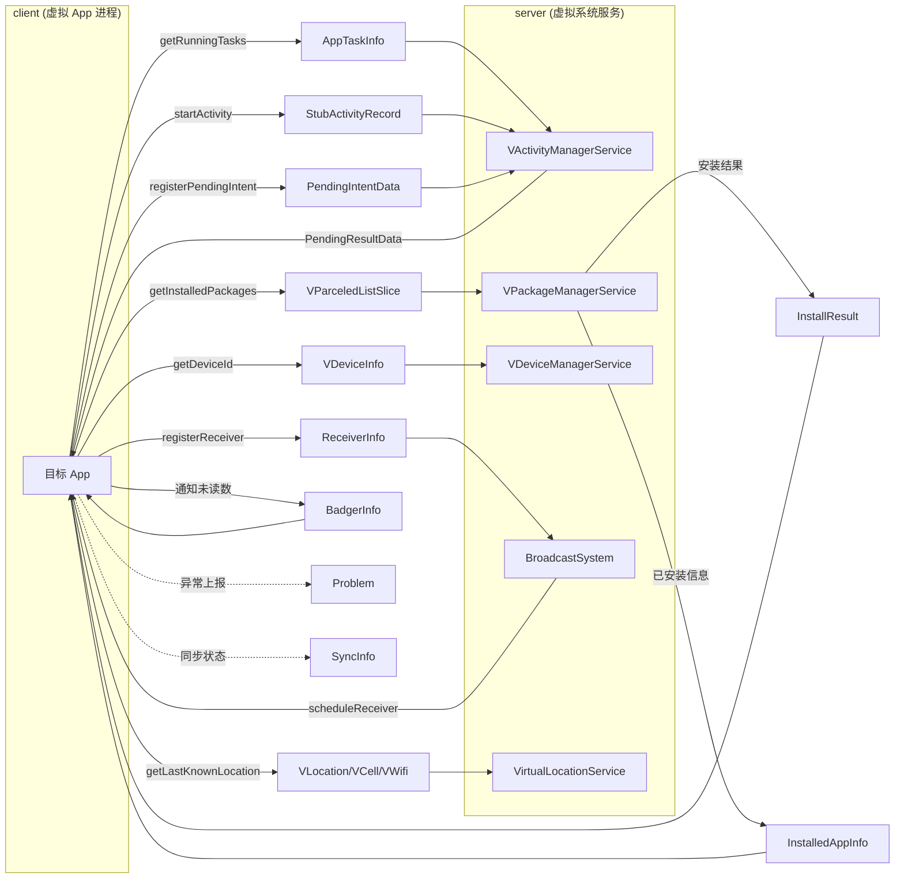

# remote · 跨进程数据类

::: tip 源码路径
[src/main/java/com/lody/virtual/remote/](https://github.com/android-security-engineer/VirtualXposed-skills/tree/vxp/VirtualApp/lib/src/main/java/com/lody/virtual/remote/) + `os/`
:::

跨进程传递的数据模型（`Parcelable`）。server 与客户端之间通过 Binder 传递这些对象。

## 文件组成

### remote 顶层

| 类 | 内容 |
| --- | --- |
| `InstalledAppInfo` | 已安装虚拟 App 信息（apkPath/odexFile/libPath/appId），客户端遍历模块时用 |
| `InstallResult` | 安装结果 |
| `AppTaskInfo` | 安装任务信息 |
| `VDeviceInfo` | 伪造设备信息（[设备信息伪造](../../features/device-spoofing)） |
| `StubActivityRecord` | Stub Activity 还原记录（[Stub Activity](../../features/stub-activity)） |
| `PendingIntentData` / [`PendingResultData`](./pending-result-data) | PendingIntent / 广播结果数据 |
| `ReceiverInfo` | 接收器信息 |
| `SyncInfo` | 同步信息 |
| `BadgerInfo` | 角标信息 |
| `Problem` | 问题记录 |
| `VParceledListSlice` | 跨进程 List 传递 |

### remote/vloc

| 类 | 内容 |
| --- | --- |
| [`VLocation`](./vlocation) | 伪造经纬度（含 `toSysLocation` 反检测） |
| [`VCell`](./vcell) | 伪造基站（CID/LAC/MCC/MNC） |
| [`VWifi`](./vwifi) | 伪造 WiFi 扫描结果（SSID/BSSID/level） |

### os

| 类 | 内容 |
| --- | --- |
| `VUserHandle` | 虚拟用户句柄（`getUid(userId, appId)` 编码） |
| `VUserInfo` | 虚拟用户信息 |
| `VUserManager` | 用户管理 |
| `VEnvironment` | 虚拟环境路径（所有私有目录/odex/数据目录） |
| `VBinder` | 虚拟 Binder 工具 |

`VEnvironment` 是所有虚拟路径的来源——`getDataAppPackageDirectory`/`getOdexFile`/`getVirtualLocationFile` 等被 server 各服务使用，见 [PMS](../server/pm) 的目录布局。

## 数据类在系统中的流转

每个 `Parcelable` 都是 server 与 client 之间一次 Binder 调用的载荷——理解它们的字段就是理解虚拟系统各服务的跨进程契约。
