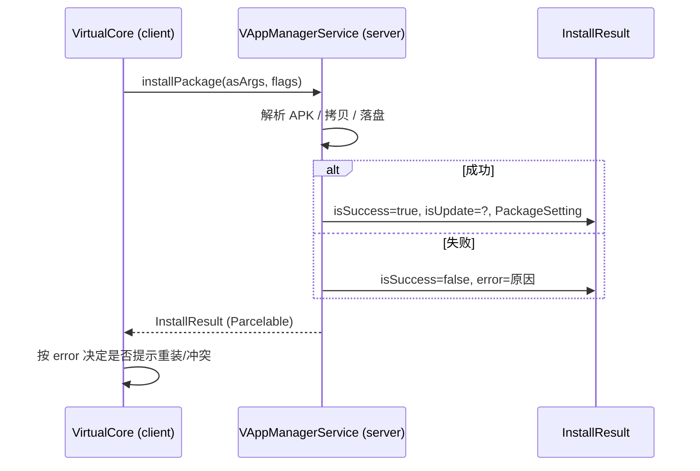

# InstallResult · 安装结果

::: tip 源码路径
[`src/main/java/com/lody/virtual/remote/InstallResult.java`](https://github.com/android-security-engineer/VirtualXposed-skills/blob/vxp/VirtualApp/lib/src/main/java/com/lody/virtual/remote/InstallResult.java)
:::

安装操作的结果（`Parcelable`）。`installPackage` 跨进程返回给调用方。

## 关键字段

- `boolean isSuccess` — 是否成功
- `boolean isUpdate` — 是否为更新
- `String error` — 失败原因
- `PackageSetting` — 成功后的包设置

## 用途

`VirtualCore.installPackage` 调 server `VAppManagerService.installPackage`，结果以 `InstallResult` 返回。

## 安装结果流

