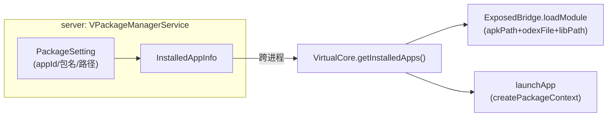

# InstalledAppInfo · 已安装 App 信息

::: tip 源码路径
[`src/main/java/com/lody/virtual/remote/InstalledAppInfo.java`](https://github.com/android-security-engineer/VirtualXposed-skills/blob/vxp/VirtualApp/lib/src/main/java/com/lody/virtual/remote/InstalledAppInfo.java)
:::

已安装虚拟 App 的信息载体（`Parcelable`）。跨进程传递一个虚拟 App 的关键路径信息。

## 关键字段

- `String packageName` — 包名
- `String apkPath` — APK 路径
- `File odexFile` — odex 文件
- `String libPath` — native 库目录
- `int appId` — 虚拟 appId
- `boolean dependSystem` — 是否复用系统版本

## 用途

`VirtualCore.getInstalledApps()` 返回它，[Xposed 模块加载](/xposed/module-loading) 遍历模块时取 `apkPath`/`odexFile`/`libPath` 传给 `ExposedBridge.loadModule`。

## 路径信息来源

`apkPath` 来自安装时拷贝到的虚拟数据目录，`odexFile`/`libPath` 由 [`VEnvironment`](./index) 计算得出，`appId` 由 [`UidSystem`](../server/am) 分配。
