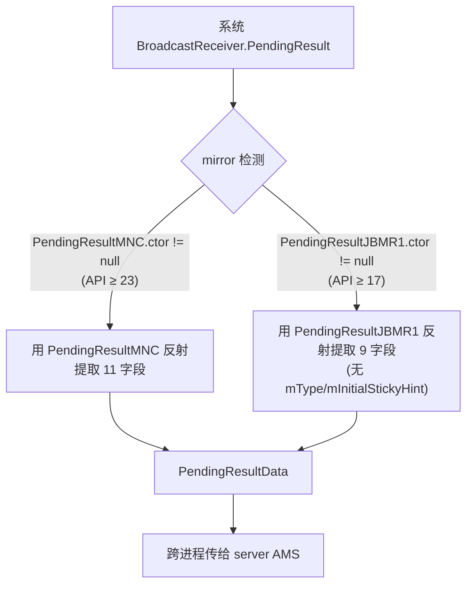
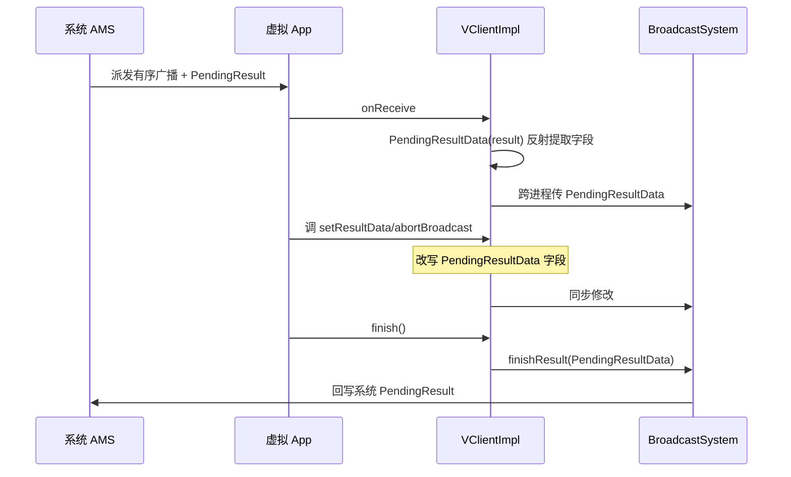

# PendingResultData · 广播结果 IPC 数据

::: tip 源码路径
[`src/main/java/com/lody/virtual/remote/PendingResultData.java`](https://github.com/android-security-engineer/VirtualXposed-skills/blob/vxp/VirtualApp/lib/src/main/java/com/lody/virtual/remote/PendingResultData.java)
:::

`BroadcastReceiver.PendingResult` 的可序列化快照，`Parcelable`。虚拟 App 收到有序广播后，把系统的 `PendingResult` 拆成纯数据跨进程传给 [server 端 AMS](../server/am)，由 `BroadcastSystem` 统一管理广播生命周期。

## 真实字段

从源码提取（全部为 public 字段）：

| 字段 | 类型 | 含义 |
| --- | --- | --- |
| `mType` | int | 广播类型（MNC 版本才有） |
| `mOrderedHint` | boolean | 是否有序广播 |
| `mInitialStickyHint` | boolean | 初始 sticky 标记 |
| `mToken` | IBinder | 广播 token（系统 AMS 识别用） |
| `mSendingUser` | int | 发送方 userId |
| `mFlags` | int | 广播 flags |
| `mResultCode` | int | 结果码 |
| `mResultData` | String | 结果数据 |
| `mResultExtras` | Bundle | 结果 extras |
| `mAbortBroadcast` | boolean | 是否中止广播 |
| `mFinished` | boolean | 是否已调 finish |

## 版本兼容构造

构造函数用 mirror 反射，按 API 级别选不同镜像类：

JBMR1 版本少 `mType`/`mInitialStickyHint` 两字段——这两个是 MNC 新增的。

## 使用方

| 引用方 | 用途 |
| --- | --- |
| `BroadcastSystem` | server 端持有，调 `finishResult` 时回写系统 PendingResult |
| `VActivityManagerService` | 调度广播时构造 |
| `VActivityManager` / `VClientImpl` | client 端接收并还原为系统 PendingResult |

## 广播结果跨进程流转

广播的 `setResultCode`/`setResultData`/`abortBroadcast` 等调用在虚拟 App 进程内改的是 `PendingResultData` 的字段，最终由 `BroadcastSystem` 统一回写到系统 `PendingResult`——避免虚拟 App 直接持有系统 Binder。

详见 [Activity Manager](../../features/activity-manager) 与 [IPC 桥](../../features/ipc-bridge)。
