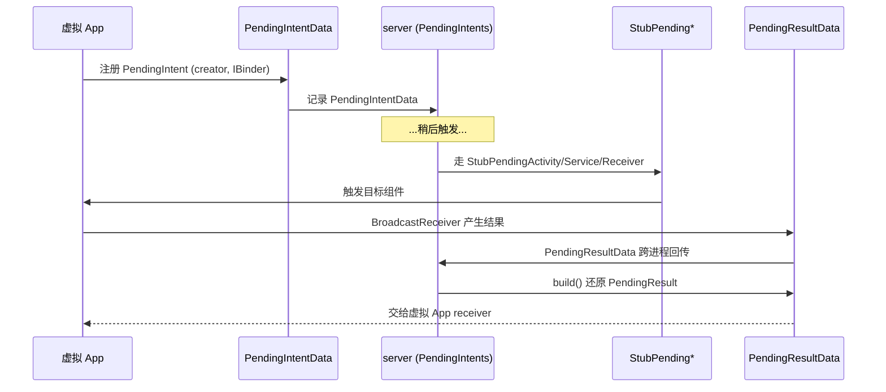

# PendingIntentData / PendingResultData · PendingIntent 数据

::: tip 源码路径
[`src/main/java/com/lody/virtual/remote/PendingIntentData.java`](https://github.com/android-security-engineer/VirtualXposed-skills/blob/vxp/VirtualApp/lib/src/main/java/com/lody/virtual/remote/PendingIntentData.java) + `PendingResultData.java`
:::

这两个 `Parcelable` 类是 PendingIntent 在虚拟环境下的跨进程数据载体。配合 [PendingIntents](../server/am-classes/pending-intents) 与 [stub 组件](../client/stub) 的 `StubPending*`，确保 PendingIntent 在虚拟环境内身份一致、触发正确。

## PendingIntentData

记录「谁注册了 PendingIntent」。

| 字段 | 类型 | 含义 |
| --- | --- | --- |
| `creator` | `String` | 注册方标识（通常是包名） |
| `pendingIntent` | `PendingIntent` | 真实的 PendingIntent 对象 |

### readPendingIntent 的技巧

构造时接收的是 `IBinder`，而非直接 `PendingIntent`。`readPendingIntent(IBinder)` 把 binder 写进一个临时 `Parcel`，再用 `PendingIntent.readPendingIntentOrNullFromParcel` 读回——这是跨进程传 PendingIntent 句柄的标准手法，因为 binder 不能直接 cast 成 PendingIntent。

## PendingResultData

记录「广播触发后的结果」，对应 `BroadcastReceiver.PendingResult`。

| 字段 | 类型 | 含义 |
| --- | --- | --- |
| `mType` | `int` | 结果类型 |
| `mResultCode` / `mResultData` / `mResultExtras` | `int`/`String`/`Bundle` | 有序广播的结果 |
| `mOrderedHint` / `mInitialStickyHint` | `boolean` | 有序/粘性提示 |
| `mToken` | `IBinder` | 结果 token |
| `mSendingUser` / `mFlags` | `int` | 发送用户 / 标志 |
| `mAbortBroadcast` / `mFinished` | `boolean` | 是否中止/已完成 |

| 方法 | 作用 |
| --- | --- |
| `PendingResultData(BroadcastReceiver.PendingResult result)` | 从真 PendingResult 构造 |
| `build()` | 反向重建 `BroadcastReceiver.PendingResult` |
| `finish()` | 标记广播处理完成 |

## 工作流

1. 目标 App 注册 PendingIntent → 真实信息以 `PendingIntentData` 记录到 server。
2. 触发时走 `StubPendingActivity`/`StubPendingService`/`StubPendingReceiver`（[stub](../client/stub)）。
3. 广播结果以 `PendingResultData` 跨进程回传，`build()` 还原成 `PendingResult` 交给虚拟 App 的 receiver。

## 关联

- [PendingIntents](../server/am-classes/pending-intents)：PendingIntent 管理器。
- [stub 组件](../client/stub)：`StubPending*`。
- [Stub Activity](/features/stub-activity)。
