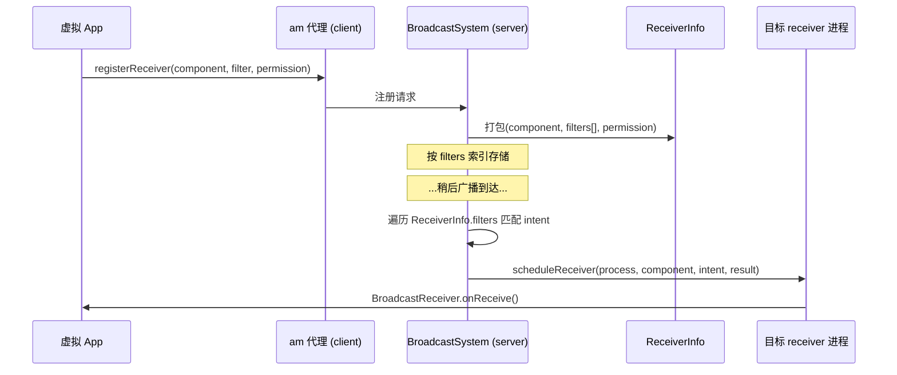

# ReceiverInfo · 接收器信息

::: tip 源码路径
[`src/main/java/com/lody/virtual/remote/ReceiverInfo.java`](https://github.com/android-security-engineer/VirtualXposed-skills/blob/vxp/VirtualApp/lib/src/main/java/com/lody/virtual/remote/ReceiverInfo.java)
:::

`ReceiverInfo` 是广播接收器信息载体，实现 `Parcelable`。`BroadcastSystem` 注册 receiver 时记录其 ComponentName、IntentFilter 集合与权限，跨进程传递。

## 字段

| 字段 | 类型 | 含义 |
| --- | --- | --- |
| `component` | `ComponentName` | 接收器组件名 |
| `filters` | `IntentFilter[]` | 该 receiver 关心的多个 IntentFilter |
| `permission` | `String` | 接收所需的权限 |

## Parcel 实现

依次写出 `component`、`filters` 数组、`permission` 字符串；`CREATOR` 重建。

## 用途

虚拟 App 通过 `registerReceiver` 动态注册接收器时，注册信息以 `ReceiverInfo` 形式存到 server 的 `BroadcastSystem`。广播分发时 server 按各 `ReceiverInfo.filters` 匹配目标，再通过 IPC 触发 client 端对应 receiver 的 `onReceive`。

## 注册与分发流

## 关联

- [Stub Activity](/features/stub-activity) 与广播调度。
- [`VActivityManagerService`](../server/am)：广播分发。
- [`ComponentUtils`](../helper/utils/component-utils)：组件匹配辅助。
