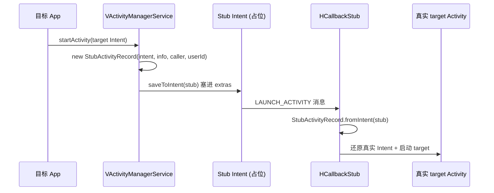
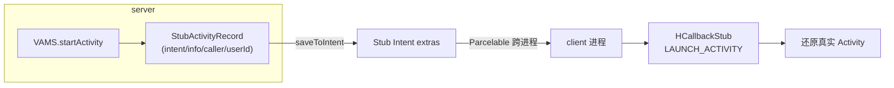

# StubActivityRecord · Stub Activity 记录

::: tip 源码路径
[`src/main/java/com/lody/virtual/remote/StubActivityRecord.java`](https://github.com/android-security-engineer/VirtualXposed-skills/blob/vxp/VirtualApp/lib/src/main/java/com/lody/virtual/remote/StubActivityRecord.java)
:::

Stub Activity 的还原记录（`Parcelable`）。承载"真实 Intent"在 Stub Intent 的 extras 里跨进程传递。详见 [Stub Activity](/features/stub-activity)。

## 关键字段

- `Intent intent` — 真实目标 Intent
- `ActivityInfo info` — 目标 Activity 信息
- `ComponentName caller` — 调用方
- `int userId` — 虚拟用户

另有 `saveToIntent(Intent stub)` / `fromIntent(Intent stub)` 在 Stub Intent 的 extras 里读写自身。

## 用途

虚拟 AMS 启动 Activity 时，把真实 Intent 包成 `StubActivityRecord` 塞进 Stub Intent 的 extras；客户端 `HCallbackStub` 在 `LAUNCH_ACTIVITY` 取出还原。

## 还原流程

