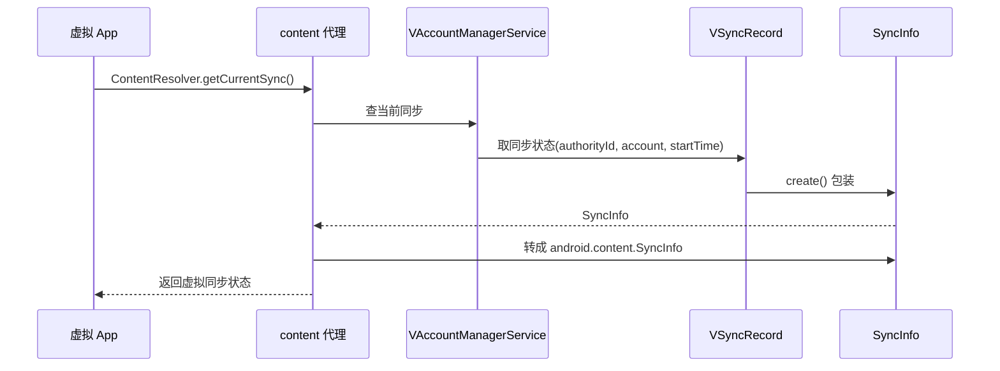

# SyncInfo · 同步信息

::: tip 源码路径
[`src/main/java/com/lody/virtual/remote/SyncInfo.java`](https://github.com/android-security-engineer/VirtualXposed-skills/blob/vxp/VirtualApp/lib/src/main/java/com/lody/virtual/remote/SyncInfo.java)
:::

`SyncInfo` 是账户同步信息载体。对应 AOSP `android.content.SyncInfo`，但 VirtualXposed 自己实现一份以便在低版本/虚拟环境下用，配合 [`VAccountManagerService`](../server/accounts) 与 `VSyncRecord` 记录账户同步状态。

## 字段

| 字段 | 类型 | 含义 |
| --- | --- | --- |
| `authorityId` | `int` | 同步 authority 的 id |
| `account` | `Account` | 同步的账户 |
| `authority` | `String` | 同步 authority（如 `com.android.contacts`） |
| `startTime` | `long` | 同步开始时间 |

## Parcel 实现

实现 `Parcelable`，并提供 `create()` 方法把虚拟 `SyncInfo` 转回真实的 `android.content.SyncInfo`，供 hook 返回给虚拟 App。

## 用途

[content 代理](../proxies/content) 拦截 `ContentResolver` 同步相关查询（`getCurrentSync` / `getCurrentSyncs`）时，从 `VSyncRecord` 取出同步状态，包装成 `SyncInfo` 返回，让虚拟 App 看到的是虚拟账户的同步状态而非真系统。

## 同步状态查询流

## 关联

- [`VAccountManagerService`](../server/accounts)：账户存储。
- [content 代理](../proxies/content)：同步查询拦截。
- [`ContentResolverCompat`](../helper/compat/content-resolver-compat)：同步常量。
