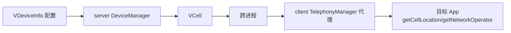

# VCell · 虚拟基站数据

::: tip 源码路径
[`src/main/java/com/lody/virtual/remote/vloc/VCell.java`](https://github.com/android-security-engineer/VirtualXposed-skills/blob/vxp/VirtualApp/lib/src/main/java/com/lody/virtual/remote/vloc/VCell.java)
:::

虚拟基站信息数据类，`Parcelable`。承载伪造的基站标识（CID/LAC/MCC/MNC 等），跨进程从 [server 端 DeviceManager](../server/device) 传给 client 端的 [TelephonyManager 代理](../proxies/telephony)。

## 真实字段

从源码提取（全部为 public int）：

| 字段 | 含义 |
| --- | --- |
| `type` | 基站类型（GSM/CDMA） |
| `mcc` | 移动国家码（Mobile Country Code） |
| `mnc` | 移动网络码（Mobile Network Code） |
| `psc` | 主扰码（GSM UMTS） |
| `lac` | 位置区码（Location Area Code） |
| `cid` | 小区标识（Cell ID） |
| `baseStationId` | 基站 ID（CDMA） |
| `systemId` | 系统 ID（CDMA） |
| `networkId` | 网络 ID（CDMA） |

GSM 制式用 `mcc/mnc/lac/cid/psc`，CDMA 制式用 `baseStationId/systemId/networkId`，`type` 区分。

## 在虚拟定位链中的位置

`VCell` 是 [虚拟定位](../../features/virtual-location) 的基站部分，与 [VLocation](./vlocation)（经纬度）、[VWifi](./vwifi)（WiFi）共同构成完整的虚拟位置信息。详见 [设备信息伪造](../../features/device-spoofing)。

## 与 AOSP 的对应

VCell 的字段对应 AOSP 的 `CdmaCellLocation`（`baseStationId/systemId/networkId`）与 `GsmCellLocation`（`lac/cid/psc`）——TelephonyManager 代理用 VCell 还原出对应 `CellLocation` 对象返回给 App。
