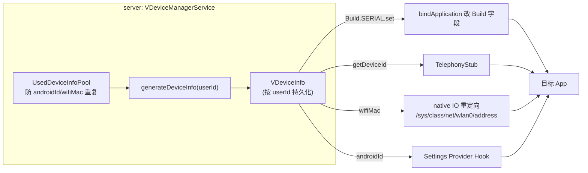

# VDeviceInfo · 设备信息

::: tip 源码路径
[`src/main/java/com/lody/virtual/remote/VDeviceInfo.java`](https://github.com/android-security-engineer/VirtualXposed-skills/blob/vxp/VirtualApp/lib/src/main/java/com/lody/virtual/remote/VDeviceInfo.java)
:::

伪造设备信息载体（`Parcelable`）。按 userId 持久化的伪造设备标识。详见 [设备信息伪造](/features/device-spoofing)。

## 关键字段

- `deviceId` — IMEI/MEID
- `androidId` — Settings.Secure.ANDROID_ID
- `wifiMac` / `bluetoothMac` — MAC
- `iccId` — SIM ICCID
- `serial` — Build.SERIAL
- `gmsAdId` — Google 广告 ID

## 用途

`VDeviceManagerService.getDeviceInfo(userId)` 返回它，[phonesubinfo](../proxies/phonesubinfo)/[telephony](../proxies/telephony) 代理据此返回伪造值。

## 按用户隔离与四路注入

关键：同一虚拟用户下所有 App 看到相同设备信息（模拟"一台设备"），不同用户看到不同（模拟"多台设备"）。详见 [设备信息伪造](/features/device-spoofing)。
