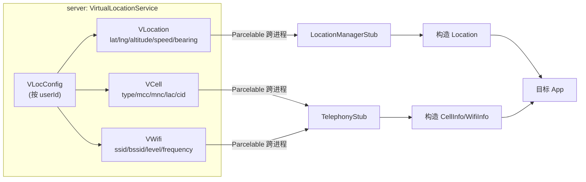

# VLocation / VCell / VWifi · 定位伪造数据

::: tip 源码路径
[src/main/java/com/lody/virtual/remote/vloc/](https://github.com/android-security-engineer/VirtualXposed-skills/tree/vxp/VirtualApp/lib/src/main/java/com/lody/virtual/remote/vloc/)（`VLocation.java` + `VCell.java` + `VWifi.java`）
:::

虚拟定位的伪造数据载体（均 `Parcelable`），在 `remote/vloc/` 下。详见 [虚拟定位](/features/virtual-location)。

## 三个类

| 类 | 内容 |
| --- | --- |
| `VLocation` | 伪造经纬度（lat/lng） |
| `VCell` | 伪造基站（CID/LAC/MCC/MNC/信号强度/类型） |
| `VWifi` | 伪造 WiFi 扫描结果（BSSID/SSID/信号） |

## 用途

`VirtualLocationService` 的 `VLocConfig` 持有它们，[location](../proxies/location)/[telephony](../proxies/telephony) 代理返回伪造值时构造对应的真实 Android 对象（如 `Location`/`CellInfo`），通过 mirror 访问其隐藏构造。

## 伪造数据流

三类伪造数据各对应一组真实 API：`VLocation`→`LocationManager.getLastKnownLocation`，`VCell`→`TelephonyManager.getAllCellInfo`，`VWifi`→`WifiManager.getScanResults`。
