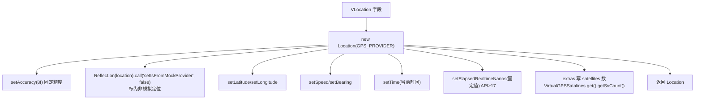
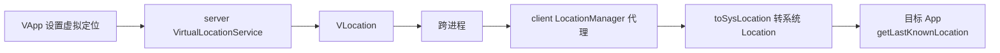

# VLocation · 虚拟经纬度数据

::: tip 源码路径
[`src/main/java/com/lody/virtual/remote/vloc/VLocation.java`](https://github.com/android-security-engineer/VirtualXposed-skills/blob/vxp/VirtualApp/lib/src/main/java/com/lody/virtual/remote/vloc/VLocation.java)
:::

虚拟定位数据类，`Parcelable`。承载伪造的经纬度，跨进程从 [server 端 LocationManager](../server/location) 传给 client 端的 [LocationManager 代理](../proxies/location)，由 `toSysLocation()` 还原成系统 `Location` 对象。

## 真实字段

从源码提取：

| 字段 | 类型 | 含义 |
| --- | --- | --- |
| `latitude` | double | 纬度（默认 0.0） |
| `longitude` | double | 经度（默认 0.0） |
| `altitude` | double | 海拔 |
| `accuracy` | float | 精度 |
| `speed` | float | 速度 |
| `bearing` | float | 方向 |

## 关键方法

| 方法 | 作用 |
| --- | --- |
| `isEmpty()` | `latitude == 0 && longitude == 0`，判断是否未设置 |
| `toSysLocation()` | 转换为系统 `Location` 对象（GPS_PROVIDER） |

`toSysLocation()` 的关键细节——它不只是赋值字段，还做了**反检测**：

`setIsFromMockProvider(false)` 是核心反检测：Android 6+ 的 `Location.isFromMockProvider()` 本会暴露虚拟定位，这里用反射强制置 false，让 App 检测不到模拟定位。

## 虚拟定位数据流

`VirtualGPSSatalines` 提供伪造的卫星数，写入 `extras` 的 `satellites`/`satellitesvalue`，让 `GpsStatus` 相关 API 也返回合理值。

详见 [虚拟定位](../../features/virtual-location)。
