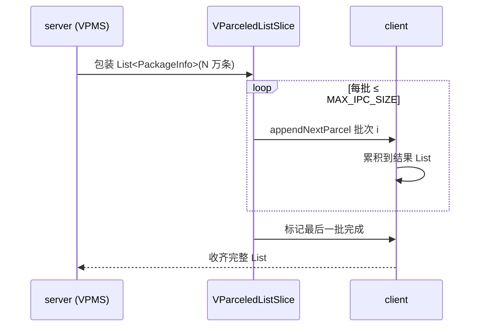
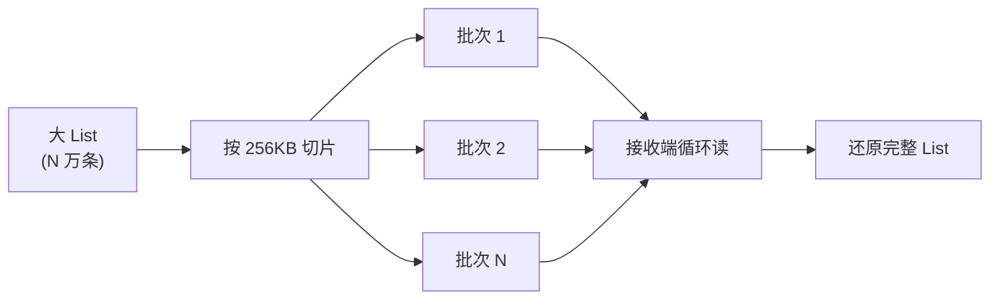

# VParceledListSlice · 跨进程 List

::: tip 源码路径
[`src/main/java/com/lody/virtual/remote/VParceledListSlice.java`](https://github.com/android-security-engineer/VirtualXposed-skills/blob/vxp/VirtualApp/lib/src/main/java/com/lody/virtual/remote/VParceledListSlice.java)
:::

`VParceledListSlice<T extends Parcelable>` 是 VirtualXposed 自带的跨进程 List 传递载体，对应 AOSP 的 `ParceledListSlice`——把大 List 拆成多个 Parcel 分批传递，避免单次 Binder 事务超 1MB 限制。

## 关键常量

| 常量 | 值 | 含义 |
| --- | --- | --- |
| `MAX_IPC_SIZE` | `256 * 1024` | 单次 Parcel 最大字节数 |
| `MAX_FIRST_IPC_SIZE` | `MAX_IPC_SIZE / 2` | 首次 Parcel 上限（更保守） |

## API

| 方法 | 作用 |
| --- | --- |
| `VParceledListSlice(List<T> list)` | 包装一个列表 |
| `getList()` | 取出内部列表 |
| `writeToParcel(dest, flags)` | 分批写出（自动按 `MAX_IPC_SIZE` 切片） |
| `CREATOR` | 从 Parcel 逐批读回拼接 |

## 分批机制

`writeToParcel` 不是一次性写完整个列表，而是边写边检查 Parcel 大小，超过 `MAX_IPC_SIZE` 就结束当前批次、标记还有后续；读取端循环读多批次直到收齐。这样几万条 `PackageInfo` 也能安全跨进程传。

## 分批传递机制

## 为什么自带一份

AOSP 的 `ParceledListSlice` 在某些低版本不可用或签名不同。VirtualXposed 自带纯实现，搭配 [`ParceledListSliceCompat`](../helper/compat/parceled-list-slice-compat) 在「真 `ParceledListSlice`」与「`VParceledListSlice`」之间转换，保证全版本一致行为。

## 用途

[PMS 代理](../proxies/pm) / [`VPackageManagerService`](../server/pm) 返回 `queryIntentActivities` / `getInstalledPackages` 等大列表时使用。

## 关联

- [`ParceledListSliceCompat`](../helper/compat/parceled-list-slice-compat)：兼容适配层。
- [pm 代理](../proxies/pm)、[`VPackageManagerService`](../server/pm)。
