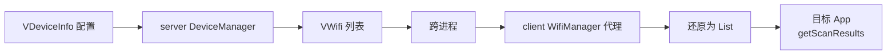
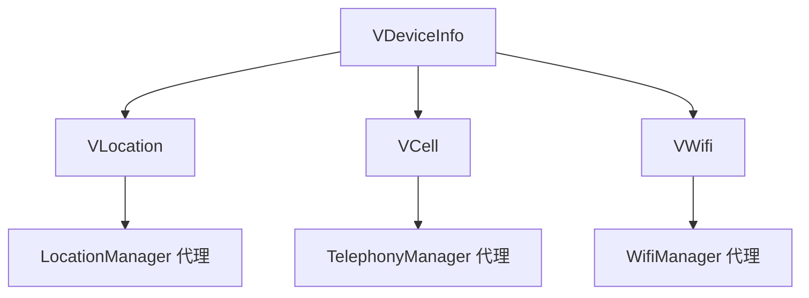

# VWifi · 虚拟 WiFi 扫描数据

::: tip 源码路径
[`src/main/java/com/lody/virtual/remote/vloc/VWifi.java`](https://github.com/android-security-engineer/VirtualXposed-skills/blob/vxp/VirtualApp/lib/src/main/java/com/lody/virtual/remote/vloc/VWifi.java)
:::

虚拟 WiFi 扫描结果数据类，`Parcelable`。承载单个伪造的 WiFi 热点信息（SSID/BSSID/信号强度等），跨进程从 [server 端 DeviceManager](../server/device) 传给 client 端的 [WifiManager 代理](../proxies/wifi)。

## 真实字段

从源码提取：

| 字段 | 类型 | 含义 |
| --- | --- | --- |
| `ssid` | String | WiFi 名称 |
| `bssid` | String | 接入点 MAC 地址 |
| `capabilities` | String | 加密能力（WPA2/OPEN 等） |
| `level` | int | 信号强度（dBm） |
| `frequency` | int | 频率（MHz） |
| `timestamp` | long | 时间戳 |

字段对应 AOSP `ScanResult` 的核心字段——WifiManager 代理用 `VWifi` 还原出 `ScanResult` 返回给 App。

## 在虚拟 WiFi 链中的位置

`VWifi` 是单条扫描结果，server 端通常维护一个 `List<VWifi>`，`getScanResults` 时整批跨进程返回。详见 [设备信息伪造](../../features/device-spoofing)。

## 与 VCell/VLocation 的关系

VWifi 与 [VCell](./vcell)（基站）、[VLocation](./vlocation)（经纬度）共同构成虚拟位置三件套——三者都来自 `VDeviceInfo` 配置，由 server 端 DeviceManager 统一分发，client 端各自的系统服务代理（TelephonyManager/LocationManager/WifiManager）消费：

