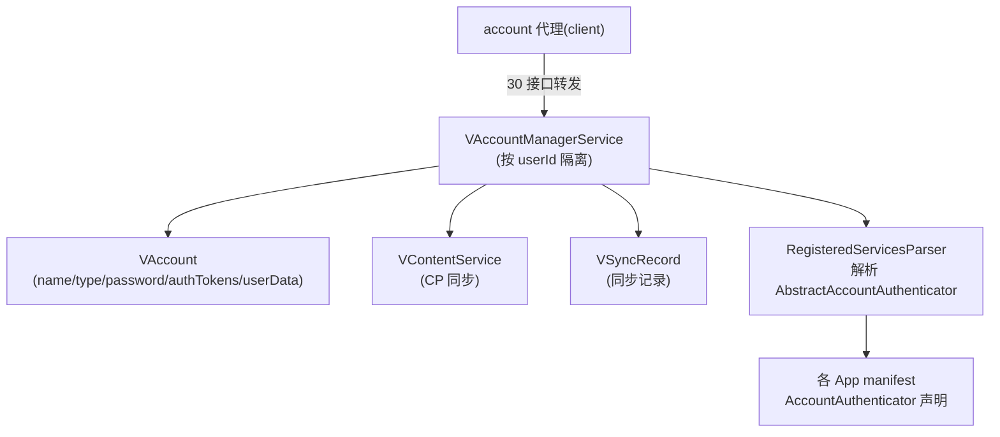

# server/accounts · 虚拟账户服务

::: tip 源码路径
[`src/main/java/com/lody/virtual/server/accounts/`](https://github.com/android-security-engineer/VirtualXposed-skills/tree/vxp/VirtualApp/lib/src/main/java/com/lody/virtual/server/accounts)
:::

`VAccountManagerService` 重新实现账户管理，让每个虚拟用户拥有独立的账户空间（不污染真实系统账户）。共 5 个文件。

## 文件组成

| 文件 | 职责 |
| --- | --- |
| `VAccountManagerService.java` | 服务主类，账户增删查改、auth token 管理 |
| `VAccount.java` | 虚拟账户数据模型 |
| `VContentService.java` | 账户相关 ContentProvider 同步 |
| `VSyncRecord.java` | 账户同步记录 |
| `RegisteredServicesParser.java` | 解析已注册的 Authenticator 服务（manifest 里的 `AccountAuthenticator`） |

## 核心机制

- 按 **userId** 隔离账户，不同虚拟用户的账户互不可见
- `VAccount` 持有 name/type/password/authTokens/userData
- `RegisteredServicesParser` 解析各 App 声明的 `AbstractAccountAuthenticator`，构建可用的账户类型表
- auth token 的获取/失效/设置全部走虚拟实现

## 与客户端的关系

客户端 [account 代理](../proxies/account) 把 `AccountManager` 调用转发到这里，约 30 个接口全覆盖。

## 账户服务组成

按 userId 隔离账户，`RegisteredServicesParser` 解析各 App 声明的 Authenticator 构建可用账户类型表。
