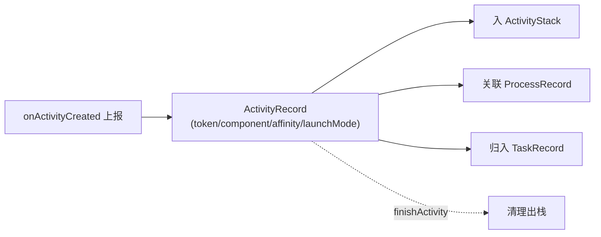

# ActivityRecord

::: tip 源码路径
[`src/main/java/com/lody/virtual/server/am/ActivityRecord.java`](https://github.com/android-security-engineer/VirtualXposed-skills/blob/vxp/VirtualApp/lib/src/main/java/com/lody/virtual/server/am/ActivityRecord.java)
:::

一个虚拟 Activity 实例的记录，对应 AOSP 的 `ActivityRecord`。当目标 App 的 Activity 启动时，server 创建此记录追踪它的状态。

## 关键字段

从源码提取的真实字段：

| 字段 | 类型 | 含义 |
| --- | --- | --- |
| `task` | `TaskRecord` | 所属任务 |
| `component` | `ComponentName` | Activity 组件名 |
| `caller` | `ComponentName` | 调用方组件 |
| `token` | `IBinder` | Activity 唯一标识（与客户端一致） |
| `userId` | `int` | 虚拟用户 ID |
| `process` | `ProcessRecord` | 所在进程 |
| `launchMode` | `int` | 启动模式 |
| `flags` | `int` | 标志位 |
| `marked` | `boolean` | 标记位（清理用） |
| `affinity` | `String` | 任务亲和性 |

构造参数顺序：`(task, component, caller, token, userId, process, launchMode, flags, affinity)`。注意没有 `Intent` 字段——Activity 的目标信息由 `component` 承载。

## 用途

`ActivityStack.onActivityCreated` 收到客户端上报后构造 `ActivityRecord`，后续 `startActivity` 查它判断"目标 Activity 所在进程是否已起"、`finishActivity` 据它清理栈。

## Activity 记录生命周期

