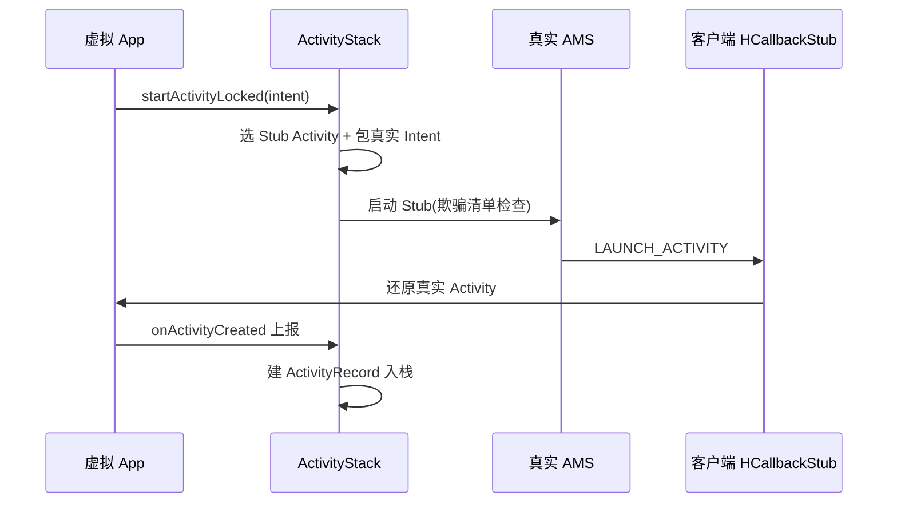

# ActivityStack

::: tip 源码路径
[`src/main/java/com/lody/virtual/server/am/ActivityStack.java`](https://github.com/android-security-engineer/VirtualXposed-skills/blob/vxp/VirtualApp/lib/src/main/java/com/lody/virtual/server/am/ActivityStack.java)
:::

虚拟 Activity 栈管理器，对应 AOSP 的 `ActivityStack`。维护虚拟 App 的 Activity 回退栈，处理 `startActivityLocked`、Activity 生命周期调度、任务归属。

## 关键职责

- `startActivityLocked` — 启动 Activity 的核心：确定目标进程、选 Stub Activity、包真实 Intent、调真实 AMS（见 [Stub Activity](../../../features/stub-activity)）
- `onActivityCreated` — 客户端创建 Activity 后上报，server 据此建 `ActivityRecord` 入栈
- 栈内 `TaskId → TaskRecord` 映射，管理任务（回退栈单元）
- Activity 的 pausing/resumed/stopped 等状态切换

## 数据结构

- `mTaskId = TaskRecord` 映射（任务列表）
- `ActivityRecord` 链表（栈内 Activity）

详见 [活动管理 (AMS)](../../../features/activity-manager)。

## Activity 启动入栈流

栈内 `TaskId → TaskRecord` 映射管理任务回退，`ActivityRecord` 链表维护 Activity 顺序与状态。
