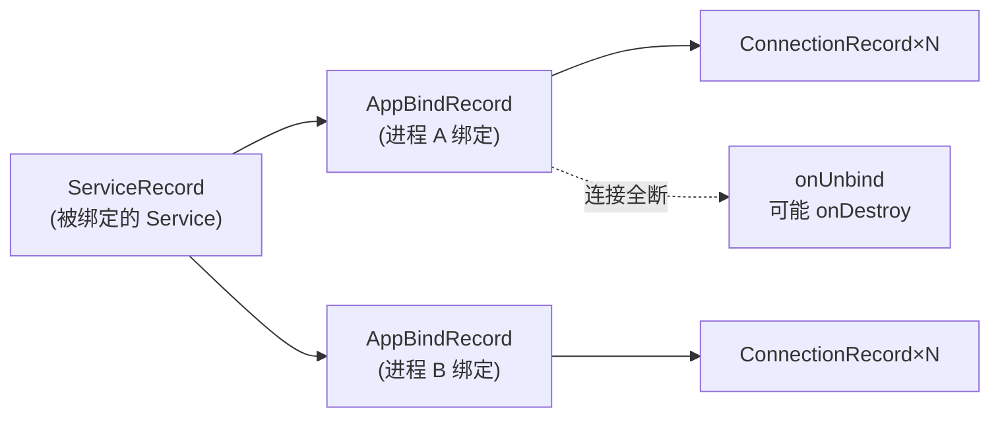

# AppBindRecord

::: tip 源码路径
[`src/main/java/com/lody/virtual/server/am/AppBindRecord.java`](https://github.com/android-security-engineer/VirtualXposed-skills/blob/vxp/VirtualApp/lib/src/main/java/com/lody/virtual/server/am/AppBindRecord.java)
:::

进程↔Service 的绑定关系记录，对应 AOSP 的 `AppBindRecord`。记录"哪个客户端进程 bind 了哪个 Service"。

## 关键字段

从源码提取的真实字段：

| 字段 | 类型 | 含义 |
| --- | --- | --- |
| `service` | `ServiceRecord` | 被绑定的 Service |
| `intent` | `ServiceRecord.IntentBindRecord` | 绑定所基于的 Intent |
| `client` | `ProcessRecord` | 绑定方进程 |
| `connections` | `HashSet<ConnectionRecord>` | 该客户端进程对此 Service 的所有连接 |

构造为 `AppBindRecord(ServiceRecord, IntentBindRecord, ProcessRecord)`。一个 `AppBindRecord` 表示「某进程通过某 Intent bind 了某 Service」这一三元关系。

## 用途

Service 被多个客户端 bind 时，`AppBindRecord` 追踪每个绑定方。所有连接断开后，server 据此决定是否调 `Service.onUnbind`/`onDestroy`、是否可杀 Service 所在进程。

## 多客户端 bind 关系

每个绑定方进程一个 `AppBindRecord`，下挂该进程对该 Service 的所有 `ConnectionRecord`。
