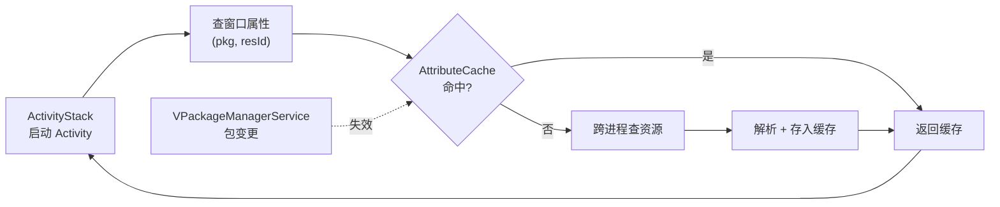

# AttributeCache · 窗口属性缓存

::: tip 源码路径
[`src/main/java/com/lody/virtual/server/am/AttributeCache.java`](https://github.com/android-security-engineer/VirtualXposed-skills/blob/vxp/VirtualApp/lib/src/main/java/com/lody/virtual/server/am/AttributeCache.java)
:::

`AttributeCache` 对应 AOSP 同名类，缓存 `WindowManager.LayoutParams` 相关的窗口属性查询结果，避免每次启动 Activity 都跨进程向真实 WindowManager 查窗口属性（主题、尺寸、动画等），减少 IPC 开销。

## 缓存结构

按 `(packageName, resId)` 二级索引缓存窗口属性集合：

- 一级键：包名（虚拟 App）。
- 二级键：`windowAnimationStyle` 等 `resId`。
- 值：解析出的窗口属性对象。

## 用途

`ActivityStack` 启动 Activity 时要查窗口属性配置主题和动画。这些属性在 App 的 resources 里，需要跨进程从虚拟 App 的资源加载器取。`AttributeCache` 把首次查询结果缓存，后续相同 (包名, resId) 直接命中，避免重复 IPC 与资源解析。

## 失效

App 升级或资源配置变化时缓存失效，由 [`VPackageManagerService`](../pm) 在包变更时通知清理对应条目。

## 缓存查询流

## 关联

- [`VActivityManagerService`](../am)：`ActivityStack` 使用方。
- [`VPackageManagerService`](../pm)：包变更触发缓存失效。
- [活动管理](/features/activity-manager)。
