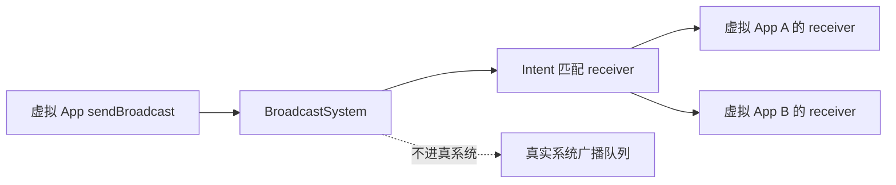

# BroadcastSystem

::: tip 源码路径
[`src/main/java/com/lody/virtual/server/am/BroadcastSystem.java`](https://github.com/android-security-engineer/VirtualXposed-skills/blob/vxp/VirtualApp/lib/src/main/java/com/lody/virtual/server/am/BroadcastSystem.java)
:::

虚拟环境内的广播分发系统，对应 AOSP 的 `BroadcastQueue`。让虚拟 App 的广播只在虚拟环境内流转，不泄漏到真系统。

## 关键职责

- **注册/注销** receiver（按 manifest 的 `<receiver>` 列表 + 运行时 `registerReceiver`）
- **发送** 广播（`sendBroadcast`），按 Intent 匹配 receiver 列表分发
- **隔离**：虚拟 App 发的 `PACKAGE_ADDED` 等系统广播不让真系统收到，反之真系统广播也不自动进虚拟环境
- `startApp`/`notifyAppInstalled` 等触发虚拟环境内的安装/启动广播

## 设计

详见 [活动管理 (AMS)](../../../features/activity-manager)。
