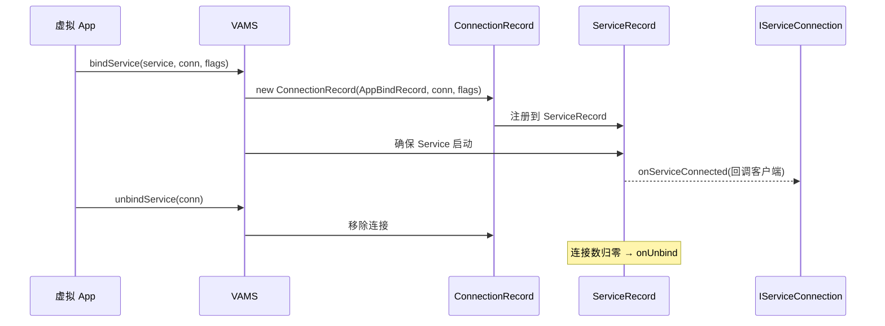

# ConnectionRecord

::: tip 源码路径
[`src/main/java/com/lody/virtual/server/am/ConnectionRecord.java`](https://github.com/android-security-engineer/VirtualXposed-skills/blob/vxp/VirtualApp/lib/src/main/java/com/lody/virtual/server/am/ConnectionRecord.java)
:::

一次 `bindService` 连接的记录，对应 AOSP 的 `ConnectionRecord`。

## 关键字段

从源码提取的真实字段：

| 字段 | 类型 | 含义 |
| --- | --- | --- |
| `binding` | `AppBindRecord` | 所属的应用↔Service 绑定关系 |
| `conn` | `IServiceConnection` | 客户端的连接回调（通知 `onServiceConnected`/`onServiceDisconnected`） |
| `flags` | `int` | bind flags（`BIND_AUTO_CREATE` 等） |
| `serviceDead` | `boolean` | Service 是否已死 |

构造为 `ConnectionRecord(AppBindRecord, IServiceConnection, int flags)`。连接方进程信息从 `binding.client` 取，不单独存字段。

## 用途

`bindService` 创建 `ConnectionRecord` 注册到 `ServiceRecord`，Service 就绪后通过 `IServiceConnection` 回调客户端。`unbindService` 移除连接，连接数归零触发 `onUnbind`。

## bind 连接流

