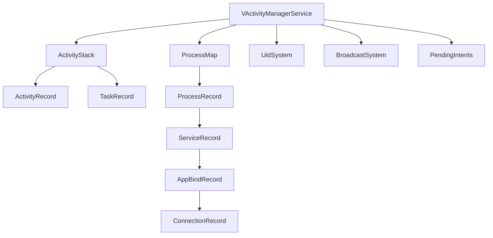

# server/am · Activity 栈与记录类

::: tip 源码路径
[`src/main/java/com/lody/virtual/server/am/`](https://github.com/android-security-engineer/VirtualXposed-skills/tree/vxp/VirtualApp/lib/src/main/java/com/lody/virtual/server/am)
:::

`VActivityManagerService` 调度所依赖的数据结构类——Activity 栈、记录、进程、Service、广播、UID。这些类和 AOSP 的 AMS 数据结构几乎同构。本索引列出每个类，详见各页。

| 类 | 对应真实系统 | 文档 |
| --- | --- | --- |
| `ActivityStack` | ActivityStack | [ActivityStack](./activity-stack) |
| `ActivityRecord` | ActivityRecord | [ActivityRecord](./activity-record) |
| `TaskRecord` | TaskRecord | [TaskRecord](./task-record) |
| `ProcessRecord` | ProcessRecord | [ProcessRecord](./process-record) |
| `ProcessMap` | ProcessMap | [ProcessMap](./process-map) |
| `ServiceRecord` | ServiceRecord | [ServiceRecord](./service-record) |
| `AppBindRecord` | AppBindRecord | [AppBindRecord](./app-bind-record) |
| `ConnectionRecord` | ConnectionRecord | [ConnectionRecord](./connection-record) |
| `BroadcastSystem` | BroadcastQueue | [BroadcastSystem](./broadcast-system) |
| `UidSystem` | — | [UidSystem](./uid-system) |
| `PendingIntents` | — | [PendingIntents](./pending-intents) |
| `AttributeCache` | AttributeCache | [AttributeCache](./attribute-cache) |

服务主类 `VActivityManagerService` 见 [am 服务总览](../am)。

## 数据结构关系

各数据结构由 `VActivityManagerService` 统一调度，与 AOSP 的 AMS 同构。
