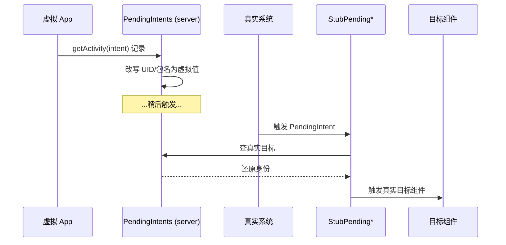

# PendingIntents

::: tip 源码路径
[`src/main/java/com/lody/virtual/server/am/PendingIntents.java`](https://github.com/android-security-engineer/VirtualXposed-skills/blob/vxp/VirtualApp/lib/src/main/java/com/lody/virtual/server/am/PendingIntents.java)
:::

虚拟 PendingIntent 管理。PendingIntent 跨进程持有、可在未来触发，VirtualXposed 需要把它映射到虚拟身份。

## 关键职责

- 注册/查询 PendingIntent（按 token）
- 改写 PendingIntent 的发起方 UID/包名为虚拟值
- 配合客户端的 `StubPendingActivity`/`StubPendingService`/`StubPendingReceiver`（见 [stub 组件](../../client/stub)）——真实系统触发 PendingIntent 时跳到 Stub 组件，再还原为真实目标

## 用途

目标 App 调 `PendingIntent.getActivity` 时，server 记录并改写身份；触发时通过 Stub 组件中转，确保 PendingIntent 在虚拟环境内正确触发且身份一致。

## PendingIntent 注册与触发

