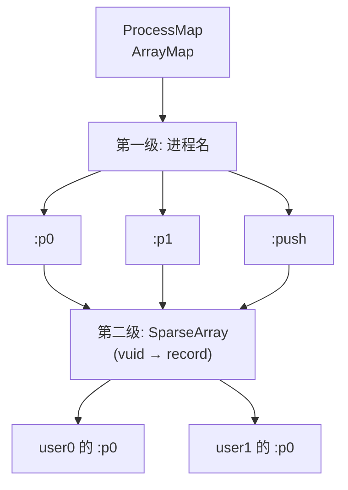

# ProcessMap

::: tip 源码路径
[`src/main/java/com/lody/virtual/server/am/ProcessMap.java`](https://github.com/android-security-engineer/VirtualXposed-skills/blob/vxp/VirtualApp/lib/src/main/java/com/lody/virtual/server/am/ProcessMap.java)
:::

`(进程名, vuid) → ProcessRecord` 的映射容器。对应 AOSP 的 `ProcessMap`。

## 设计

用 `ArrayMap<String, SparseArray<ProcessRecord>>` 实现：第一级按进程名索引，第二级按 vuid 索引——因为同一进程名（如 `:push`）可能在不同虚拟用户下各有一个实例。

## 关键方法

从源码提取的真实方法：

| 方法 | 作用 |
| --- | --- |
| `put(name, uid, value)` | 存入；进程名不存在则建 SparseArray（初始容量 2） |
| `get(name, uid)` | 按 (进程名, uid) 查 |
| `remove(name, uid)` | 移除；SparseArray 空了则从外层 Map 也移除 |
| `getMap()` | 取底层 `ArrayMap`（供遍历） |

泛型 `ProcessMap<E>`，`VActivityManagerService` 用 `ProcessMap<ProcessRecord>` 作 `mProcessNames`，是进程调度的核心索引。需按 pid 遍历时走 `getMap()` 外层迭代。

`VActivityManagerService.mProcessNames` 就是这个类型，是进程调度的核心索引。

## 两级索引结构

两级索引因为同一进程名（如 `:push`）在不同虚拟用户下各有实例，必须 `(进程名, vuid)` 联合定位。
