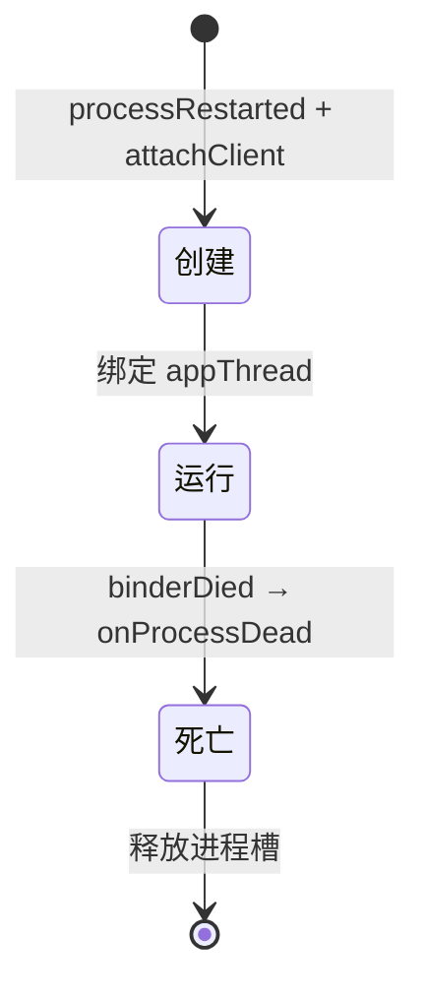

# ProcessRecord

::: tip 源码路径
[`src/main/java/com/lody/virtual/server/am/ProcessRecord.java`](https://github.com/android-security-engineer/VirtualXposed-skills/blob/vxp/VirtualApp/lib/src/main/java/com/lody/virtual/server/am/ProcessRecord.java)
:::

一个虚拟进程的记录，对应 AOSP 的 `ProcessRecord`。server 用它追踪每个跑起来的虚拟 App 进程。

## 关键字段

从源码提取的真实字段：

| 字段 | 类型 | 含义 |
| --- | --- | --- |
| `info` | `ApplicationInfo` | 进程首个 App 的信息 |
| `processName` | `String` | 进程名 |
| `client` | `IVClient` | 客户端 Binder 句柄 |
| `appThread` | `IInterface` | 应用线程接口（server 反向驱动用） |
| `pid` | `int` | 真实系统 pid |
| `vuid` | `int` | 虚拟 UID（userId + appId） |
| `vpid` | `int` | 虚拟进程 ID |
| `userId` | `int` | 虚拟用户 ID |
| `priority` | `int` | 进程优先级 |

构造为 `ProcessRecord(ApplicationInfo info, String processName, int vuid, int vpid)`，实现 `Comparable` 按 `vpid` 排序。包名信息从 `info.packageName` 取，不单独存字段。

## 生命周期

详见 [活动管理 (AMS)](../../../features/activity-manager) 的进程调度部分。
