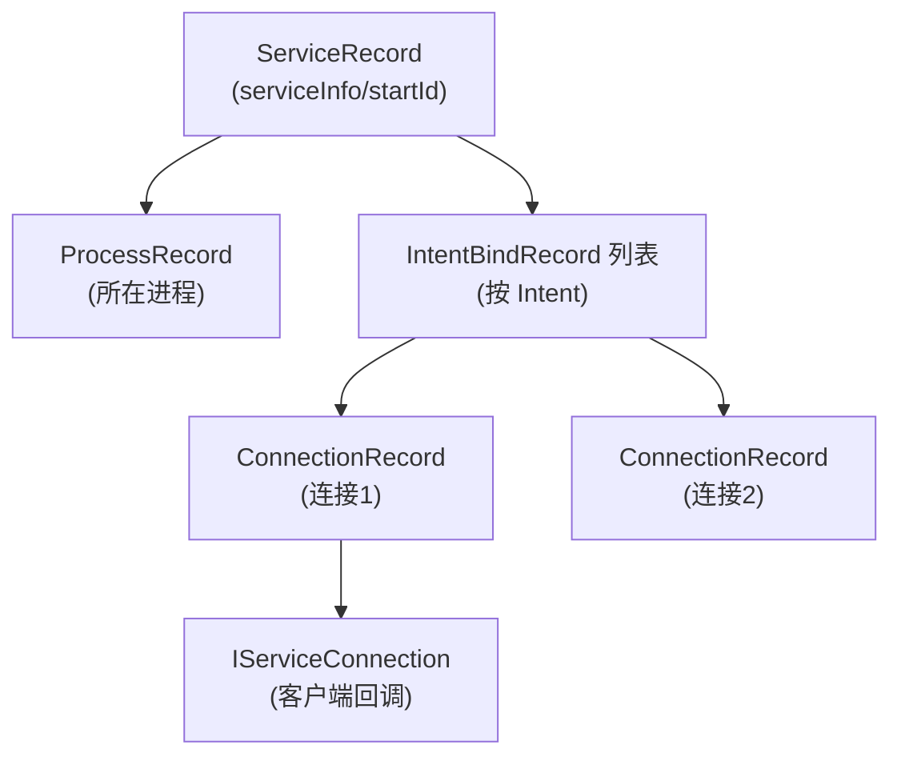

# ServiceRecord

::: tip 源码路径
[`src/main/java/com/lody/virtual/server/am/ServiceRecord.java`](https://github.com/android-security-engineer/VirtualXposed-skills/blob/vxp/VirtualApp/lib/src/main/java/com/lody/virtual/server/am/ServiceRecord.java)
:::

一个虚拟 Service 实例的记录，对应 AOSP 的 `ServiceRecord`。server 用它追踪 `startService`/`bindService` 启动的虚拟 Service。

## 关键字段

从源码提取的真实字段：

| 字段 | 类型 | 含义 |
| --- | --- | --- |
| `serviceInfo` | `ServiceInfo` | Service 组件信息（含 ComponentName） |
| `process` | `ProcessRecord` | Service 所在进程 |
| `bindings` | `List<IntentBindRecord>` | 按 Intent 的绑定关系列表 |
| `startId` | `int` | startService 计数 |
| `activeSince` | `long` | 首次激活时间 |
| `lastActivityTime` | `long` | 最近活动时间 |
| `foregroundId` | `int` | 前台 Service 通知 ID |
| `foregroundNoti` | `Notification` | 前台通知 |

内嵌 `IntentBindRecord`：一个 Intent 对应一个，持有 `connections`（`List<IServiceConnection>`）/`binder`/`doRebind`。组件名从 `serviceInfo` 取，不单独存字段。

## 用途

`VActivityManagerService.startService/bindService` 据它判断 Service 是否已起、在哪起、要不要调 `onCreate`/`onBind`/`onStartCommand`，`stopService`/`unbindService` 据它清理。

## Service 记录与绑定关系

`startId` 追踪 `startService` 次数（对应 `onStartCommand` 调用次数），`IntentBindRecord` 按 Intent 追踪所有 bind 方。
