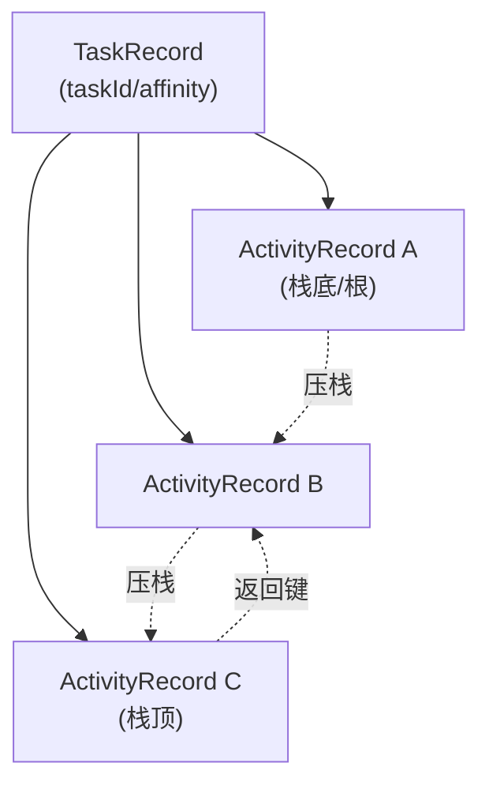

# TaskRecord

::: tip 源码路径
[`src/main/java/com/lody/virtual/server/am/TaskRecord.java`](https://github.com/android-security-engineer/VirtualXposed-skills/blob/vxp/VirtualApp/lib/src/main/java/com/lody/virtual/server/am/TaskRecord.java)
:::

一个虚拟任务（回退栈单元），对应 AOSP 的 `TaskRecord`。一个任务包含一串按顺序排列的 `ActivityRecord`，用户按返回键在任务内回退。

## 关键字段

从源码提取的真实字段：

| 字段 | 类型 | 含义 |
| --- | --- | --- |
| `activities` | `List<ActivityRecord>` | 任务内的 Activity 栈（同步列表） |
| `taskId` | `int` | 任务 ID |
| `userId` | `int` | 虚拟用户 ID |
| `affinity` | `String` | 任务亲和性（决定新 Activity 归属哪个任务） |
| `taskRoot` | `Intent` | 任务根 Intent |

`getTopActivity()` 取栈顶 `ActivityRecord.component`，`isFinishing()` 判断任务是否已结束。任务内 Activity 各自归属自己的 `ProcessRecord`，TaskRecord 不直接持有进程。

## 用途

`ActivityStack` 按 `affinity`/`launchMode`/`taskId` 决定新 Activity 加到哪个 TaskRecord。`FLAG_ACTIVITY_NEW_TASK` 等启动 flag 的语义在这里实现。

## 任务回退栈

新 Activity 按 `affinity` 归属任务，`FLAG_ACTIVITY_NEW_TASK` 创建新 `TaskRecord`，`singleTask` 模式清掉目标之上的 Activity。
