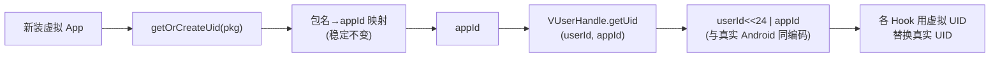

# UidSystem

::: tip 源码路径
[`src/main/java/com/lody/virtual/server/am/UidSystem.java`](https://github.com/android-security-engineer/VirtualXposed-skills/blob/vxp/VirtualApp/lib/src/main/java/com/lody/virtual/server/am/UidSystem.java)
:::

虚拟 UID（appId 部分）分配系统。真实 Android 每个 App 有独立 UID，VirtualXposed 用自己维护的虚拟 UID 空间，不向系统申请。

## 关键职责

- `getOrCreateUid(VPackage)` — 给新安装的虚拟 App 分配 appId
- 维护 `包名 → appId` 映射，保证同一个包每次安装 appId 稳定
- appId 与 userId 组合成虚拟 UID（`VUserHandle.getUid(userId, appId)`），编码方式和真实 Android 一致（`userId << 24 | appId`）

## 用途

[PMS 安装](../pm) 时调用，分配的 appId 存入 `PackageSetting`，后续所有 UID 相关 Hook 用这个虚拟 UID 替换真实 UID，使目标 App 看到的"自己的 UID"是虚拟的。

## 虚拟 UID 分配与编码

appId 稳定保证目标 App 重启后看到同一个 UID；编码方式与真实 Android 一致，使多用户隔离逻辑可复用。
