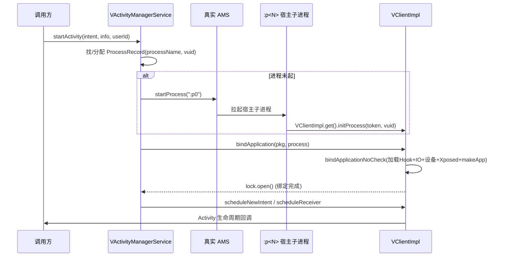
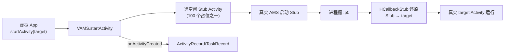
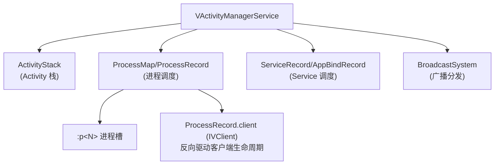

# server/am · 虚拟活动管理服务

::: tip 源码路径
[`src/main/java/com/lody/virtual/server/am/`](https://github.com/android-security-engineer/VirtualXposed-skills/tree/vxp/VirtualApp/lib/src/main/java/com/lody/virtual/server/am)
:::

`VActivityManagerService extends IActivityManager.Stub` 是虚拟 AMS 的完整实现，管理虚拟 App 的进程、Activity 栈、Service、广播。这块是 VirtualApp 最重的代码，共 **14 个文件**，数据结构和 AOSP 的 AMS 几乎同构。

## 文件组成

| 文件 | 对应真实系统 | 职责 |
| --- | --- | --- |
| [`VActivityManagerService`](https://github.com/android-security-engineer/VirtualXposed-skills/blob/vxp/VirtualApp/lib/src/main/java/com/lody/virtual/server/am/VActivityManagerService.java) | ActivityManagerService | 服务入口 `IActivityManager.Stub`，进程/Activity/Service 调度 |
| [`ActivityStack`](https://github.com/android-security-engineer/VirtualXposed-skills/blob/vxp/VirtualApp/lib/src/main/java/com/lody/virtual/server/am/ActivityStack.java) | ActivityStack | Activity 栈管理 |
| [`ActivityRecord`](https://github.com/android-security-engineer/VirtualXposed-skills/blob/vxp/VirtualApp/lib/src/main/java/com/lody/virtual/server/am/ActivityRecord.java) | ActivityRecord | 一个 Activity 实例 |
| [`TaskRecord`](https://github.com/android-security-engineer/VirtualXposed-skills/blob/vxp/VirtualApp/lib/src/main/java/com/lody/virtual/server/am/TaskRecord.java) | TaskRecord | 任务（回退栈单元） |
| [`ProcessRecord`](https://github.com/android-security-engineer/VirtualXposed-skills/blob/vxp/VirtualApp/lib/src/main/java/com/lody/virtual/server/am/ProcessRecord.java) | ProcessRecord | 一个虚拟进程记录 |
| [`ProcessMap`](https://github.com/android-security-engineer/VirtualXposed-skills/blob/vxp/VirtualApp/lib/src/main/java/com/lody/virtual/server/am/ProcessMap.java) | — | `(进程名, vuid) → ProcessRecord` 的映射容器 |
| [`AppBindRecord`](https://github.com/android-security-engineer/VirtualXposed-skills/blob/vxp/VirtualApp/lib/src/main/java/com/lody/virtual/server/am/AppBindRecord.java) | AppBindRecord | 进程↔Service 绑定关系 |
| [`ServiceRecord`](https://github.com/android-security-engineer/VirtualXposed-skills/blob/vxp/VirtualApp/lib/src/main/java/com/lody/virtual/server/am/ServiceRecord.java) | ServiceRecord | 一个 Service 实例 |
| [`ConnectionRecord`](https://github.com/android-security-engineer/VirtualXposed-skills/blob/vxp/VirtualApp/lib/src/main/java/com/lody/virtual/server/am/ConnectionRecord.java) | ConnectionRecord | 一个 bindService 连接 |
| [`PendingIntents`](https://github.com/android-security-engineer/VirtualXposed-skills/blob/vxp/VirtualApp/lib/src/main/java/com/lody/virtual/server/am/PendingIntents.java) | — | PendingIntent 管理 |
| [`UidSystem`](https://github.com/android-security-engineer/VirtualXposed-skills/blob/vxp/VirtualApp/lib/src/main/java/com/lody/virtual/server/am/UidSystem.java) | — | 虚拟 UID 分配（appId） |
| [`BroadcastSystem`](https://github.com/android-security-engineer/VirtualXposed-skills/blob/vxp/VirtualApp/lib/src/main/java/com/lody/virtual/server/am/BroadcastSystem.java) | BroadcastQueue | 虚拟环境内广播分发 |
| [`AttributeCache`](https://github.com/android-security-engineer/VirtualXposed-skills/blob/vxp/VirtualApp/lib/src/main/java/com/lody/virtual/server/am/AttributeCache.java) | AttributeCache | 窗口属性缓存 |
| [`VirtualStorageService`](https://github.com/android-security-engineer/VirtualXposed-skills/blob/vxp/VirtualApp/lib/src/main/java/com/lody/virtual/server/vs/VirtualStorageService.java) 等 | — | 虚拟存储服务（见 [vs](./vs)） |

## ProcessRecord：进程身份

`ProcessRecord` 是虚拟进程的运行时记录，关键字段：

```java
final class ProcessRecord extends Binder implements Comparable<ProcessRecord> {
    final ConditionVariable lock = new ConditionVariable();  // bindApplication 完成信号
    final ApplicationInfo info;        // 进程首个 App 信息
    final String processName;          // 进程名
    final Set<String> pkgList;         // 进程内已加载包集合
    IVClient client;                   // 客户端 IVClient 代理(server→client 反向驱动)
    int pid;                           // 真实 PID
    int vuid;                          // 虚拟 UID
    int vpid;                          // 虚拟 PID
    int userId;                        // 虚拟用户
}
```

`ProcessMap<ProcessRecord>` 按 `(processName, vuid)` 索引，server 据此找到进程的 `IVClient` 反向驱动生命周期。`lock` 这个 `ConditionVariable` 用于 `attachClient` 时阻塞，直到客户端 `bindApplication` 完成。

## 核心 API（按职责分组）

| 分组 | 方法 | 作用 |
| --- | --- | --- |
| **生命周期** | `systemReady` / `onCreate` | 服务初始化 |
| **进程** | `getSystemPid` / `attachClient`（通过 ProcessRecord） | 进程拉起与绑定 |
| **Activity** | `startActivity` / `startActivities` / `onActivityCreated` / `onActivityResumed` / `onActivityDestroyed` | Activity 启动与状态回调 |
| **任务** | `getTaskInfo` / `getPackageForToken` / `getActivityClassForToken` / `getCallingActivity` / `getCallingPackage` | 任务/Token 查询 |
| **Service** | `startService` / `stopService` / `stopServiceToken` / `bindService` / `unbindService` / `unbindFinished` / `serviceDoneExecuting` / `peekService` | Service 调度 |
| **Provider** | `acquireProviderClient` | 取虚拟 ContentProvider |
| **PendingIntent** | `getPendingIntent` / `addPendingIntent` / `removePendingIntent` / `getPackageForIntentSender` | PendingIntent 管理 |

## 进程调度：`:p<N>` 进程槽

server 不直接 fork 虚拟进程，而是借用真实 AMS 拉起宿主的一个私有进程 `:p0`/`:p1`/...（进程槽），再在该进程里 `bindApplication` 切换虚拟身份：



## Activity 启动：Stub 协作

Activity 启动配合 [Stub Activity](../../features/stub-activity) 与客户端 `HCallbackStub`——server 先用占位 Stub 欺骗真实 AMS 清单检查，再在客户端把 Stub 还原成真实目标 Activity：



## 核心机制要点

- **`:p<N>` 进程槽** + 真实 AMS 拉起宿主子进程，再 `processRestarted`/`attachClient` 绑定虚拟身份
- **进程调度数据结构**：`ProcessMap<ProcessRecord>`（`(processName, vuid) → record`）、`mPidsSelfLocked`
- **server 反向驱动客户端**：通过 `ProcessRecord.client`（`IVClient`）发 `scheduleNewIntent`/`scheduleReceiver`
- **Activity 还原**：Stub 占位 + 客户端 `HCallbackStub` 还原（见 [`AppInstrumentation`](../client/hook-delegate)）



## 子文档

| 文档 | 内容 |
| --- | --- |
| [`AttributeCache`](./am-classes/attribute-cache) | 窗口属性缓存 |
| [`PendingIntents`](./am-classes/pending-intents) | PendingIntent 管理 |

## 关联

- [活动管理 (AMS)](../../features/activity-manager)：整体机制总览。
- [Stub Activity](../../features/stub-activity)：Activity 启动的占位还原机制。
- [`VClientImpl`](../client/vclient)：server 反向驱动的客户端实现。
- [`HCallbackStub`](../client/hook-base)：客户端 Stub 还原的 Hook。
