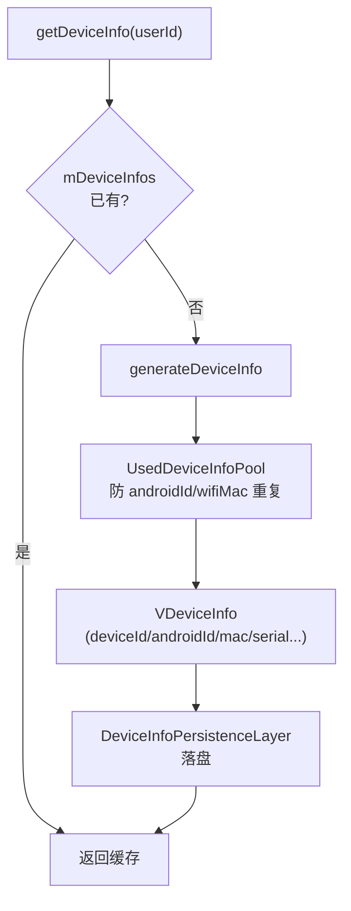

# server/device · 虚拟设备信息服务

::: tip 源码路径
[src/main/java/com/lody/virtual/server/device/](https://github.com/android-security-engineer/VirtualXposed-skills/tree/vxp/VirtualApp/lib/src/main/java/com/lody/virtual/server/device/)（`VDeviceManagerService.java` + `DeviceInfoPersistenceLayer.java`）
:::

`VDeviceManagerService` 按 userId 生成并持久化伪造设备信息。详见 [设备信息伪造](../../features/device-spoofing)。

## 文件组成

| 文件 | 职责 |
| --- | --- |
| `VDeviceManagerService.java` | 服务主类，按 userId 生成/查询 `VDeviceInfo` |
| `DeviceInfoPersistenceLayer.java` | 设备信息持久化 |

## 核心机制

- `VDeviceInfo`（定义在 `remote/`）持有 deviceId/androidId/wifiMac/bluetoothMac/iccId/serial/gmsAdId
- `UsedDeviceInfoPool` 防止 androidId/wifiMac 跨用户重复（避免关联）
- 生成后持久化，重启稳定不变
- 客户端 [phonesubinfo](../proxies/phonesubinfo)/[telephony](../proxies/telephony) 代理返回这里的伪造值

## 设备信息生成与持久化

按 userId 隔离 + 持久化，保证目标 App 重启看到同一设备信息，且不同用户模拟"多台设备"。
