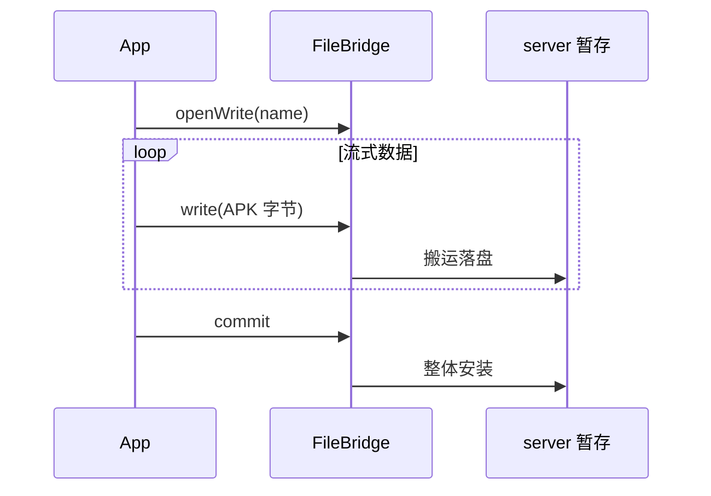

# FileBridge · 跨进程文件桥

::: tip 源码路径
[`src/main/java/com/lody/virtual/server/pm/installer/FileBridge.java`](https://github.com/android-security-engineer/VirtualXposed-skills/blob/vxp/VirtualApp/lib/src/main/java/com/lody/virtual/server/pm/installer/FileBridge.java)
:::

`FileBridge extends Thread` 是一个跨进程文件传输通道。`PackageInstallerSession.openWrite` 写入的 APK 数据，通过它在 App 进程与 server 进程之间流转。

## 机制

`FileBridge` 跑在一个线程里，一端接 App 写入的 `ParcelFileDescriptor`，另一端接 server 的暂存文件，把字节从一端搬到另一端。这样 App 端可以像写普通流一样推送 APK 数据，server 端能实时收到落盘。

## API

| 方法 | 作用 |
| --- | --- |
| `FileBridge()` | 构造 |
| `isClosed()` | 桥是否已关闭 |
| `forceClose()` | 强制关闭两端 |
| `run()` | 线程主循环，搬运字节 |

## 为什么不直接传文件路径

分阶段安装时 APK 数据是流式到达的（可能从网络边下边装），没有现成文件。`FileBridge` 提供一个「写端在 App、读端在 server」的管道，让流式数据能跨进程到达暂存目录，commit 时再整体安装。

## 跨进程文件传输

## 关联

- [`PackageInstallerSession`](./package-installer-session)：使用方。
- [虚拟包安装器总览](./pm-installer)。
