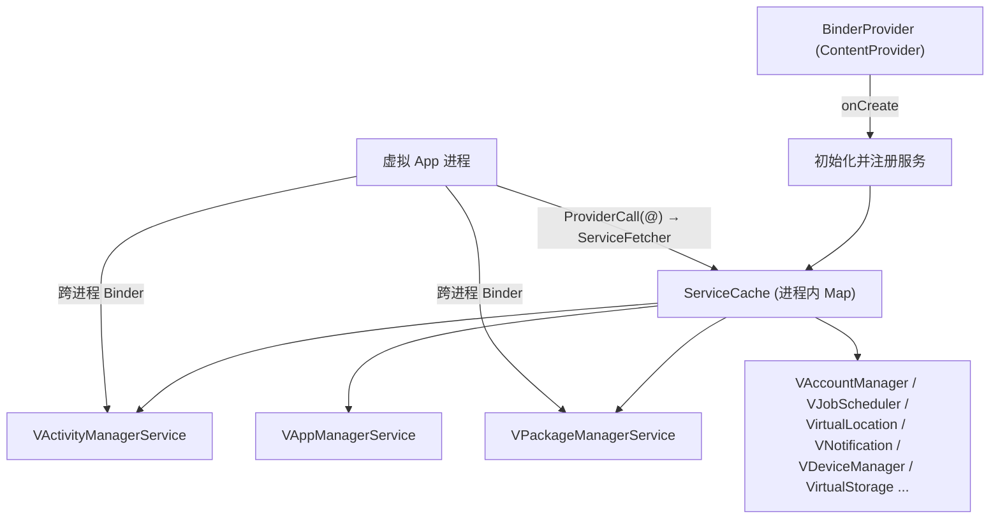

# 虚拟服务 server

::: tip 源码路径
[`src/main/java/com/lody/virtual/server/`](https://github.com/android-security-engineer/VirtualXposed-skills/tree/vxp/VirtualApp/lib/src/main/java/com/lody/virtual/server)
:::

VirtualXposed 在 **server 进程**里重新实现了一整套 Android 系统服务——这是"应用虚拟化引擎"的核心。server 通过 [`BinderProvider`](../../features/ipc-bridge) 拉起，把每个虚拟服务注册到 `ServiceCache`，供所有虚拟 App 进程跨进程调用。

## 服务总览

| 服务 | server 类 | 客户端代理 | 对应真实系统 | 文档 |
| --- | --- | --- | --- | --- |
| 活动管理 | `VActivityManagerService` | [am](../proxies/am) | ActivityManagerService | [活动管理](./am) |
| 包管理 | `VAppManagerService` / `VPackageManagerService` / `VUserManagerService` | [pm](../proxies/pm) | PackageManagerService | [包管理](./pm) |
| 账户 | `VAccountManagerService` / `VContentService` | [account](../proxies/account) | AccountManagerService | [账户](./accounts) |
| 作业调度 | `VJobSchedulerService` | [job](../proxies/job) | JobSchedulerService | [作业调度](./job) |
| 定位 | `VirtualLocationService` | [location](../proxies/location) | LocationManagerService | [虚拟定位](./location) |
| 通知 | `VNotificationManagerService` | [notification](../proxies/notification) | NotificationManagerService | [通知](./notification) |
| 设备信息 | `VDeviceManagerService` | [phonesubinfo](../proxies/phonesubinfo) | DeviceIdentifiers | [设备信息](./device) |
| 虚拟存储 | `VirtualStorageService` | [mount](../proxies/mount) | MountService | [虚拟存储](./vs) |
| IPC 基建 | `BinderProvider` / `ServiceCache` / `secondary` | — | ServiceManager | [IPC 基建](./ipc) |
| 次级服务 | `BinderDelegateService` / `FakeIdentityBinder` | — | Binder 身份 | [次级服务](./secondary) |

## 架构

每个虚拟服务都是对应 Android 系统服务的"用户态重实现"——数据结构、调度逻辑都参照 AOSP，但只作用于虚拟环境内的 App。
