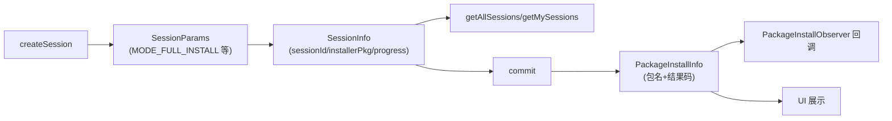

# SessionParams / SessionInfo / PackageInstallInfo · 安装会话数据

::: tip 源码路径
`SessionParams.java` · `SessionInfo.java` · `PackageInstallInfo.java`（[目录](https://github.com/android-security-engineer/VirtualXposed-skills/tree/vxp/VirtualApp/lib/src/main/java/com/lody/virtual/server/pm/installer)）
:::

installer 模块的三个数据载体类，分别承载「创建 session 的参数」「session 的运行时信息」「安装结果信息」。

## SessionParams

`Parcelable`，`createSession` 时的入参。

| 字段/常量 | 含义 |
| --- | --- |
| `MODE_INVALID` (`-1`) | 无效模式 |
| `MODE_FULL_INSTALL` (`1`) | 全新安装 |
| `MODE_INHERIT_EXISTING` (`2`) | 继承已有安装 |
| 安装模式、选项 | 传给 session 的配置 |

## SessionInfo

`Parcelable`，描述一个已存在 session 的状态。

| 字段 | 含义 |
| --- | --- |
| `sessionId` | 会话 id |
| `installerPackageName` | 发起安装的包名 |
| `resolvedBaseCodePath` | 解析出的 APK 基础路径 |
| `appIcon` / `appLabel` | 安装图标/标签 |
| `active` / `progress` | 是否活跃 / 进度 |

供 `getAllSessions` / `getMySessions` 查询展示用。

## PackageInstallInfo

非 Parcelable 的轻量结果信息，记录单次安装的关键事实（包名、结果码等），供 observer 回调和 UI 展示。

## 三个数据载体的角色

`SessionParams` 是入参，`SessionInfo` 是运行时状态，`PackageInstallInfo` 是结果——三者覆盖安装会话全生命周期。

## 关联

- [`VPackageInstallerService`](./package-installer-service)：生产这些数据。
- [虚拟包安装器总览](./pm-installer)。
