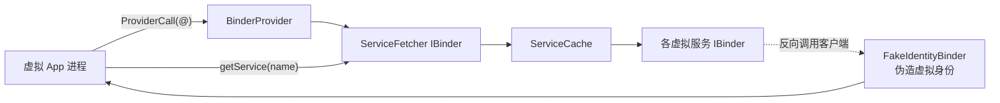

# server/secondary 与 IPC 基建

::: tip 源码路径
[src/main/java/com/lody/virtual/server/](https://github.com/android-security-engineer/VirtualXposed-skills/tree/vxp/VirtualApp/lib/src/main/java/com/lody/virtual/server/) 顶层 + `secondary/`
:::

server 的 IPC 基础设施——`BinderProvider` 是 server 入口，`ServiceCache` 是服务表，`secondary/` 提供身份伪装的 Binder 包装。

## 文件组成

| 文件 | 职责 |
| --- | --- |
| `BinderProvider.java` | server 进程入口（ContentProvider），`onCreate` 注册所有服务，`call("@")` 返回 `ServiceFetcher` |
| `ServiceCache.java` | 进程内服务表（`Map<String, IBinder>`） |
| `secondary/BinderDelegateService.java` | Binder 委托服务，按调用方身份转发 |
| `secondary/FakeIdentityBinder.java` | 伪造调用方身份的 Binder 包装 |

## 核心机制

详见 [跨进程 IPC 桥](../../features/ipc-bridge)。

`FakeIdentityBinder` 是关键技巧：它包装一个真实 IBinder，在 `transact` 时把调用方的 `callingUid`/`callingPid` 改写成虚拟身份，让被包装的服务以为调用来自虚拟 App 而非宿主。这用于 server 反向调用客户端或与真实系统服务交互时保持身份一致。

