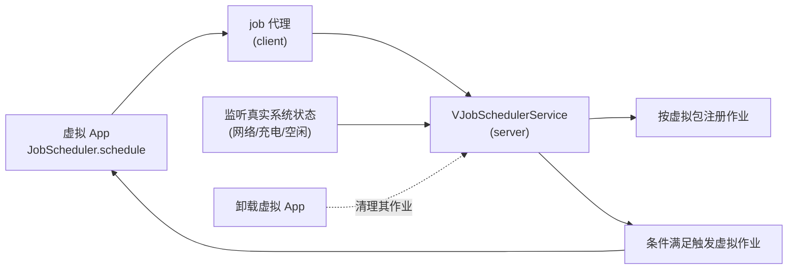

# server/job · 虚拟作业调度服务

::: tip 源码路径
[`src/main/java/com/lody/virtual/server/job/VJobSchedulerService.java`](https://github.com/android-security-engineer/VirtualXposed-skills/blob/vxp/VirtualApp/lib/src/main/java/com/lody/virtual/server/job/VJobSchedulerService.java) · `IJobScheduler.java`
:::

`VJobSchedulerService` 重新实现 `JobScheduler`，让虚拟 App 的后台作业在虚拟环境内调度。

## 文件组成

| 文件 | 职责 |
| --- | --- |
| `VJobSchedulerService.java` | 服务主类，作业注册/取消/调度 |
| `IJobScheduler.java`（server 顶层） | 作业调度接口定义 |

## 核心机制

- 虚拟 App 调 `JobScheduler.schedule` → 客户端 [job 代理](../proxies/job) 转发到这里
- 作业按虚拟包归属，卸载虚拟 App 时其作业一并清理
- 调度条件（网络/充电/空闲）由 server 监听真实系统状态后触发虚拟作业

不同于多数仅做身份改写的代理，job 是少数在 server **完整重实现**的服务之一。

## 作业调度流

server 监听真实系统状态后触发虚拟作业，卸载 App 时作业一并清理。
